# Architecture-As-Code Proposal

## Design Approval Board Framework for Techcombank

**Document Version:** 1.0
**Date:** February 2026
**Owner:** Director, Solution Architecture
**Organization:** Enterprise Architecture Technology Team
**Classification:** Internal - Strategic Proposal

---

## Table of Contents

1. [Executive Summary](#executive-summary)
2. [Introduction](#introduction)
3. [Current State Analysis](#current-state-analysis)
4. [Proposed Solution: Architecture-As-Code](#proposed-solution-architecture-as-code)
5. [Tools Comparison](#tools-comparison)
6. [Benefits Analysis](#benefits-analysis)
7. [GenAI & AI Opportunities](#genai--ai-opportunities)
8. [ROI Analysis](#roi-analysis)
9. [Migration Strategy](#migration-strategy)
10. [Risk Assessment](#risk-assessment)
11. [Change Management Plan](#change-management-plan)
12. [Implementation Roadmap](#implementation-roadmap)
13. [Operation Model: Running the DAB Process Across Teams](#operation-model-running-the-dab-process-across-teams)
14. [Recommendations](#recommendations)
15. [Appendices](#appendices)

---

## Executive Summary

This proposal presents a strategic initiative to transform Techcombank's Design Approval Board process through **Architecture-As-Code (AaC)**, leveraging GitLab's native Markdown and MermaidJS diagram rendering capabilities. This approach represents a fundamental shift from document-centric to code-centric architecture governance, aligning with industry best practices and enabling significant operational efficiencies.

### Key Highlights

| Dimension           | Current State              | Proposed State                             |
| ------------------- | -------------------------- | ------------------------------------------ |
| **Platform**        | Confluence + Drawio Plugin | GitLab + Native Mermaid                    |
| **Version Control** | Manual page history        | Git-native versioning                      |
| **Review Process**  | Comment-based              | Merge Request workflow                     |
| **Diagram Format**  | Binary/XML attachments     | Text-based (Mermaid/PlantUML)              |
| **Knowledge Reuse** | Copy-paste patterns        | Single Source of Truth with embedding      |
| **AI Readiness**    | Limited                    | Full GenAI integration with auto-retrieval |

### Key Differentiators

🎯 **Single Source of Truth (SSOT)**

- All Architecture Principles, Design Patterns, and Best Practices in ONE repository
- Embed and reference content across documents - write once, use everywhere
- Update once → automatically reflected in all referencing documents
- Zero documentation drift, 100% consistency

🤖 **AI Knowledge Base Server**

- AI automatically retrieves relevant patterns, standards, and prior art
- **Zero manual search** - architects ask questions, AI finds answers
- Semantic understanding of architecture context
- 95% reduction in research time

### Business Case Summary

- **Architecture Review Cycle:** 50-60% faster with structured MR workflow
- **Knowledge Discovery:** 95% reduction in search/research time via AI auto-retrieval
- **Documentation Consistency:** 100% - Single Source of Truth eliminates drift
- **Compliance & Audit:** Full traceability with automated approval trails
- **AI Readiness:** Future-proof platform for GenAI integration

### Strategic Alignment

This initiative directly supports:

- Techcombank's digital transformation strategy
- Regulatory compliance requirements (BIAN framework compatibility)
- Enterprise agility and DevOps maturity goals
- AI-first documentation strategy for 2026 and beyond

---

## Introduction

### What is Architecture-As-Code?

Architecture-As-Code (AaC) represents a paradigm shift in how organizations approach enterprise architecture documentation and governance. Inspired by Infrastructure-as-Code (IaC), AaC treats architectural designs as programmable assets that can be version-controlled, tested, and automated.

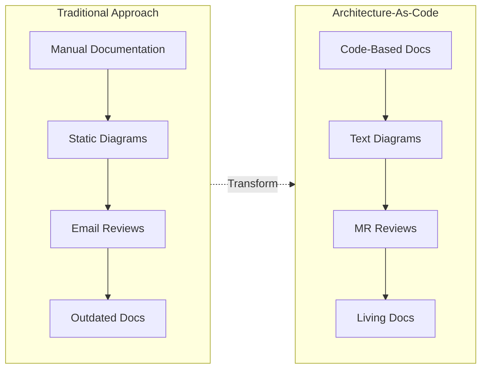

### Why Now?

Several converging factors make this the optimal time for Techcombank to adopt Architecture-As-Code:

1. **Industry Momentum:** Cloud-based enterprise architecture solutions are expected to dominate the market, accounting for over 65% of total revenue by 2026
2. **GenAI Maturity:** 75% of developers will use MCP servers for AI tools by 2026, enabling real-time documentation management
3. **Regulatory Pressure:** Banking frameworks like BIAN increasingly emphasize standardized, auditable architecture documentation
4. **Technical Debt:** Current Confluence/Drawio approach accumulates hidden costs and version control challenges

### Scope of This Proposal

This proposal covers:

- Full business case with ROI analysis
- Detailed comparison with current Confluence/Drawio setup
- Migration strategy and implementation roadmap
- Change management plan
- GenAI integration opportunities

---

## Current State Analysis

### Current Architecture Documentation Landscape

Techcombank currently utilizes Confluence as the primary platform for architecture documentation, supplemented by the Drawio plugin for diagram creation. This setup incorporates both PlantUML and MermaidJS for embedded diagrams.

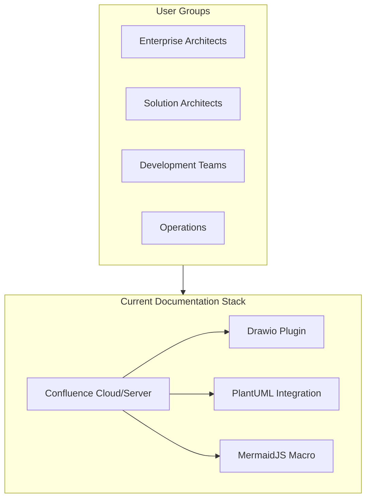

### Identified Challenges

#### 1. Version Control Limitations

| Challenge                                   | Impact                                    | Severity |
| ------------------------------------------- | ----------------------------------------- | -------- |
| Page history lacks granular diff capability | Cannot track incremental diagram changes  | High     |
| No branch/merge workflow                    | Linear evolution only, no parallel work   | High     |
| Attachment versioning separate from page    | Diagrams desynced from documentation      | Medium   |
| No rollback to specific diagram state       | Risk of losing valid architectural states | Medium   |

#### 2. Drawio Plugin Constraints

**Technical Issues:**

- Enterprise network firewalls (particularly Palo Alto) can block plugin installation
- Plugin files containing signatures may be blocked, preventing complete downloads
- Third-party dependency creates vendor risk (Drawio is not made by Atlassian)
- Diagram data stored as multiple attachments (rendered image + vector version)
- Migration to Forge platform (deadline January 2026) introduces transition risk

**Operational Constraints:**

| Constraint             | Description                              | Impact                            |
| ---------------------- | ---------------------------------------- | --------------------------------- |
| **Vendor Dependency**  | Third-party plugin not made by Atlassian | Separate support, update cycles   |
| **Platform Migration** | Forge platform deadline January 2026     | Transition risk, potential rework |
| **Binary Format**      | Diagrams stored as attachments, not text | Cannot diff, merge, or AI-analyze |
| **No Git Integration** | Cannot version control with code         | Architecture-code disconnect      |

> **Key Insight:** With Architecture-As-Code, diagramming uses native GitLab Mermaid rendering - no plugins, no vendor dependencies, full text-based version control.

**Configuration Challenges:**

- Upgrading to Drawio 13.0.0+ creates mandatory "draw.io configuration" space
- Space key conflicts during multi-site consolidation
- Sensitive labels on diagrams exclude them from search results

#### 3. Collaboration Inefficiencies

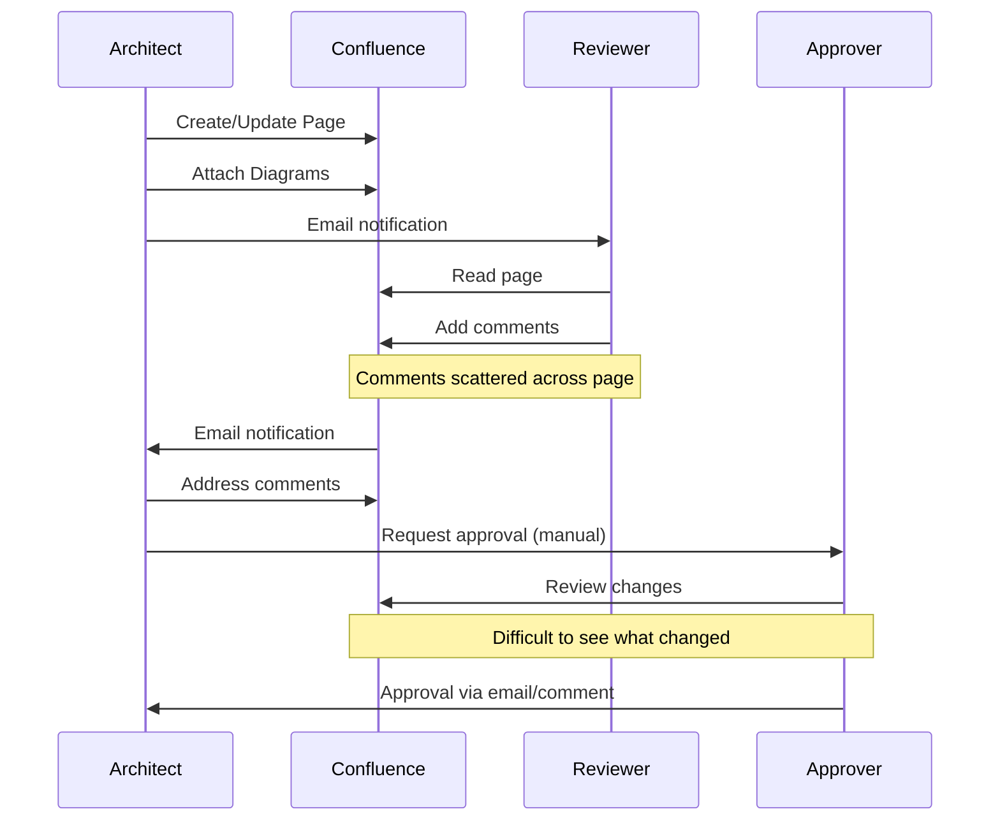

**Pain Points:**

- No structured review workflow - comments are scattered and untrackable
- Approval status not formally tracked or auditable
- Difficult to identify what changed between reviews
- Email-based notifications create communication gaps
- No automated compliance checks

**Approval Process Comparison: Confluence vs GitLab**

| Capability               | Confluence (Current)                   | GitLab (Proposed)                           |
| ------------------------ | -------------------------------------- | ------------------------------------------- |
| **Multi-Level Approval** | Not supported - informal comments only | Native support with configurable stages     |
| **Approval Sequencing**  | Manual coordination via email          | Enforced: L1 must complete before L2        |
| **Parallel Reviews**     | Not possible                           | Security + Domain can review simultaneously |
| **Required Approvers**   | Cannot enforce - anyone can "approve"  | Configurable rules per path/domain          |
| **CODEOWNERS**           | Not available                          | Auto-assign reviewers by file path          |
| **Approval Status**      | Scattered in comments                  | Clear status badges on MR                   |
| **Change Visibility**    | "View history" - no diff               | Line-by-line diff with comments             |
| **Audit Trail**          | Basic page history                     | Complete: who, when, what, why              |
| **Blocking Merge**       | Cannot prevent publication             | MR blocked until all approvals received     |
| **SLA Tracking**         | Manual spreadsheet                     | Built-in analytics dashboard                |
| **Delegation**           | Informal                               | Formal deputy assignment                    |
| **Mobile Approval**      | Limited                                | Full mobile app support                     |

> **Critical Gap:** In Confluence, there is no way to **enforce** that a Security Architect must approve before an Enterprise Architect. In GitLab, this is a configurable rule that cannot be bypassed.

#### 4. Search and Discovery Issues

- Diagram content not indexed for search
- Architecture decision rationale buried in page text
- Cross-referencing between documents is manual
- No capability to query architecture relationships programmatically

#### 5. AI/Automation Readiness Gap

The current setup has limited capability to integrate with emerging AI tools:

- No standardized format for LLM consumption (no llms.txt support)
- Binary diagram formats prevent AI analysis
- Manual tagging and metadata management
- No Model Context Protocol (MCP) integration path

### Current State Operational Impact Summary

| Challenge Area            | Operational Impact                           | Consequence                          |
| ------------------------- | -------------------------------------------- | ------------------------------------ |
| **Version Control Gap**   | Cannot track diagram changes or rollback     | Risk of losing valid designs         |
| **Review Inefficiency**   | 10-15 day review cycles, no parallel reviews | Delayed project timelines            |
| **Documentation Drift**   | 40-50% of docs outdated                      | Projects built on stale architecture |
| **Pattern Inconsistency** | 60-70% adherence to standards                | Fragmented enterprise architecture   |
| **Knowledge Silos**       | 2-4 hours to find relevant patterns          | Architects reinvent the wheel        |
| **No AI Integration**     | Binary formats, no semantic indexing         | Cannot leverage GenAI capabilities   |
| **Audit Burden**          | Weeks to compile compliance evidence         | Manual, error-prone process          |

---

## Proposed Solution: Architecture-As-Code

### Solution Overview

The proposed Architecture-As-Code framework leverages GitLab as the single source of truth for all architecture documentation, with native Markdown rendering and MermaidJS/PlantUML diagram support.

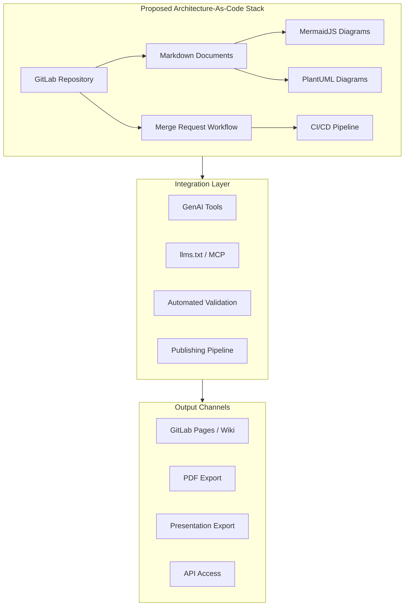

### Core Components

#### 1. GitLab Repository Structure

```
techcombank-architecture/
├── README.md                      # Repository overview
├── llms.txt                       # AI context file
├── CONTRIBUTING.md                # Contribution guidelines
├── .gitlab-ci.yml                 # CI/CD pipeline
│
├── governance/
│   ├── design-approval-board/
│   │   ├── process.md            # DAB process documentation
│   │   ├── templates/            # Standard templates
│   │   └── decisions/            # Architecture Decision Records
│   └── standards/
│       ├── naming-conventions.md
│       └── diagram-standards.md
│
├── domains/
│   ├── core-banking/
│   │   ├── README.md
│   │   ├── context.md            # Domain context
│   │   ├── capabilities.md       # Business capabilities
│   │   └── diagrams/
│   ├── digital-channels/
│   ├── payments/
│   ├── risk-management/
│   └── data-platform/
│
├── patterns/
│   ├── integration/
│   ├── security/
│   └── data/
│
└── templates/
    ├── solution-design.md
    ├── architecture-decision-record.md
    └── component-specification.md
```

#### 2. Single Source of Truth: Reusable Architecture Knowledge Base

**This is one of the most powerful advantages of Architecture-As-Code.** All Architecture Principles, Design Patterns, Best Practices, and Standards exist in ONE centralized repository and can be **instantly referenced and embedded** into any document across the organization.

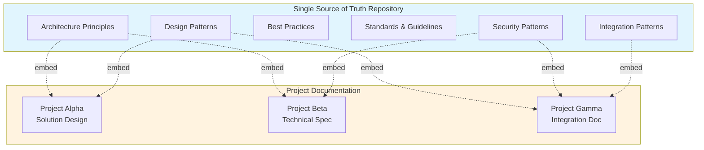

**Key Capabilities:**

| Capability              | Description                                                    | Business Value                         |
| ----------------------- | -------------------------------------------------------------- | -------------------------------------- |
| **Markdown Includes**   | Embed content from one file into another using GitLab includes | Write once, use everywhere             |
| **Transclusion**        | Reference specific sections or diagrams across documents       | Consistent patterns across all designs |
| **Single Update**       | Change a pattern once → automatically reflected everywhere     | Zero drift between documentation       |
| **Version Inheritance** | All references point to latest approved version                | Always current, never stale            |
| **Dependency Tracking** | Know which documents use which patterns                        | Impact analysis for changes            |

**Example: Embedding Architecture Principles**

```markdown
<!-- In any Solution Design document -->

## Applicable Architecture Principles

<!-- Automatically pulls latest content from central repository -->





## Solution-Specific Design

[Project-specific content here...]
```

**Current Problem (Confluence):**

- Patterns are copy-pasted into each document
- Updates require manual changes across 50+ documents
- Version drift creates inconsistencies
- No way to track which documents use which patterns

**Proposed Solution (GitLab + AaC):**

- Single definition, multiple references
- Automatic propagation of updates
- Full traceability via Git history
- CI/CD can validate pattern compliance

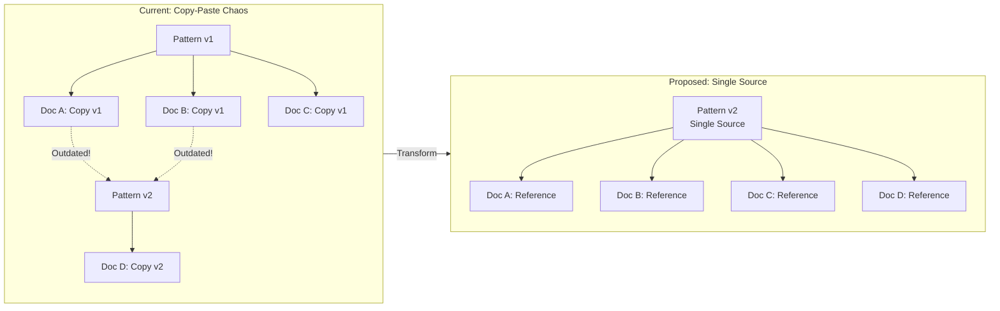

#### 3. Design Approval Board Workflow

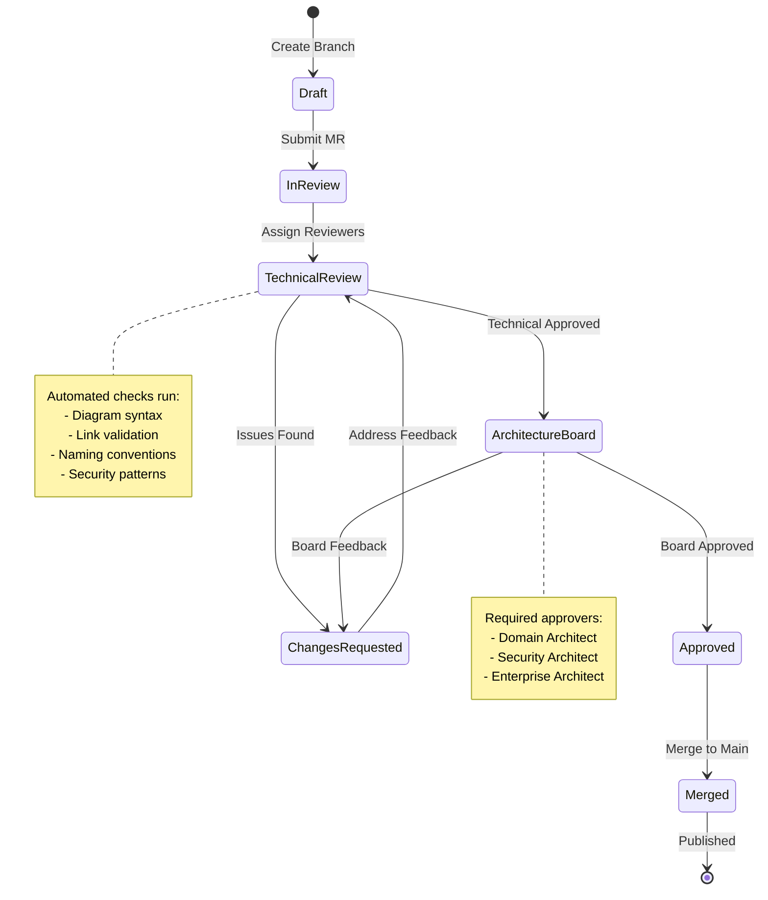

#### 3. Multi-Level Merge Request Approval Workflow

GitLab's approval rules enable **structured, auditable, multi-stage approval** that mirrors enterprise governance requirements - something impossible to achieve reliably in Confluence.

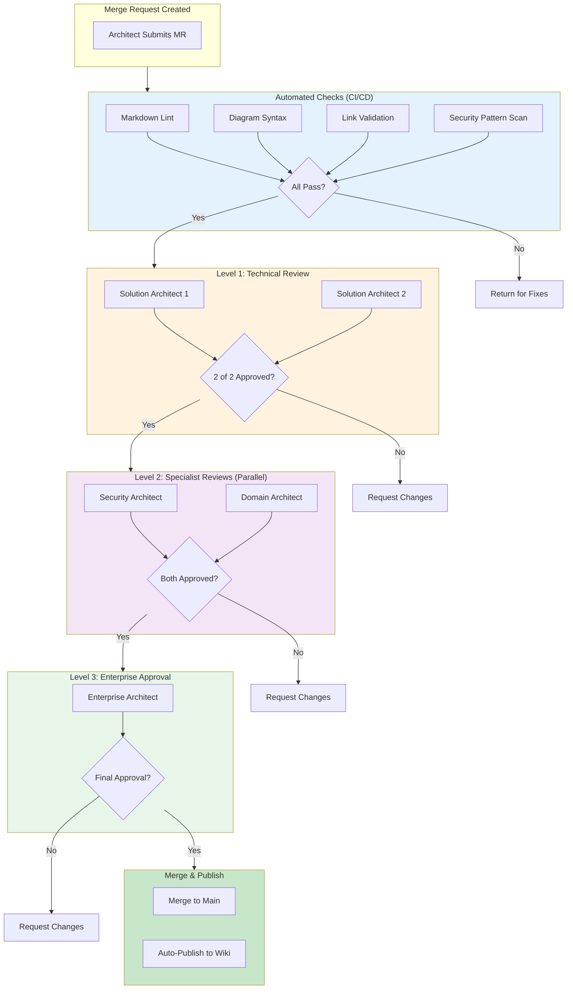

**Approval Rules Configuration:**

| Review Stage         | Required Approvers     | Approval Rule                        | Auto-Assigned Via    |
| -------------------- | ---------------------- | ------------------------------------ | -------------------- |
| **Automated Checks** | CI/CD Pipeline         | Must pass before human review        | GitLab CI            |
| **Technical Review** | 2 Solution Architects  | Any 2 from SA group                  | CODEOWNERS by path   |
| **Security Review**  | 1 Security Architect   | Required for `/patterns/security/*`  | CODEOWNERS + labels  |
| **Domain Review**    | 1 Domain Architect     | Required for domain-specific changes | CODEOWNERS by domain |
| **Final Approval**   | 1 Enterprise Architect | Required for all architecture docs   | Approval rule group  |

**CODEOWNERS Example (`.gitlab/CODEOWNERS`):**

```
# Default: Enterprise Architecture team reviews all
*                           @ea-team

# Domain-specific ownership
/domains/core-banking/      @domain-arch-core-banking @ea-team
/domains/digital-channels/  @domain-arch-digital @ea-team
/domains/payments/          @domain-arch-payments @ea-team
/domains/risk-management/   @domain-arch-risk @ea-team
/domains/data-platform/     @domain-arch-data @ea-team

# Patterns require specialist review
/patterns/security/         @security-architecture @ea-team
/patterns/integration/      @integration-architecture @ea-team
/patterns/data/             @data-architecture @ea-team

# Governance changes require EA Director approval
/governance/                @ea-director @ea-team

# Principles require multiple EA approvals
/principles/                @ea-team (2 approvals required)
```

**Key Benefits of Multi-Level Approval:**

| Benefit               | Description                              | Confluence Comparison            |
| --------------------- | ---------------------------------------- | -------------------------------- |
| **Enforced Sequence** | L2 cannot approve until L1 completes     | No workflow enforcement          |
| **Parallel Reviews**  | Security + Domain review simultaneously  | Sequential email chains          |
| **Audit Trail**       | Every approval timestamped with comments | Comments scattered, no audit     |
| **Auto-Assignment**   | Reviewers assigned by file path/domain   | Manual reviewer selection        |
| **Blocking Rules**    | MR cannot merge without all approvals    | Anyone can "approve" via comment |
| **Delegation**        | Approvers can delegate to deputies       | No formal delegation             |
| **SLA Tracking**      | Time-to-approval metrics per stage       | No visibility into delays        |
| **Compliance Ready**  | Full audit log for regulators            | Manual report compilation        |

**Approval Metrics Dashboard (GitLab):**

| Metric               | Target                 | Tracked Automatically |
| -------------------- | ---------------------- | --------------------- |
| Time to first review | < 24 hours             | Yes                   |
| Time L1 → L2         | < 48 hours             | Yes                   |
| Time L2 → L3         | < 24 hours             | Yes                   |
| Total cycle time     | < 5 business days      | Yes                   |
| Approval rate        | > 80% first submission | Yes                   |
| Rework rate          | < 20%                  | Yes                   |

#### 4. Document Generation & Auto Wiki Publishing

One of the most powerful capabilities of Architecture-As-Code is **automated document generation** and **continuous publishing**. Once an MR is merged, documentation is automatically transformed and published - no manual export or upload required.

```mermaid
flowchart LR
    subgraph Source["Source (GitLab Repo)"]
        MD[Markdown Files]
        MERM[Mermaid Diagrams]
        PLANT[PlantUML Diagrams]
        ASSET[Images & Assets]
    end

    subgraph Pipeline["CI/CD Pipeline"]
        TRIG[Merge Trigger]
        BUILD[Build Process]
        RENDER[Render Diagrams]
        GEN[Generate Outputs]
    end

    subgraph Outputs["Auto-Generated Outputs"]
        WIKI[GitLab Wiki]
        PAGES[GitLab Pages]
        PDF[PDF Documents]
        DOCX[Word Documents]
        HTML[Static HTML Site]
    end

    Source --> Pipeline
    Pipeline --> Outputs

    style Source fill:#e3f2fd
    style Pipeline fill:#fff3e0
    style Outputs fill:#e8f5e9
```

**Document Generation Pipeline:**

````yaml
# .gitlab-ci.yml - Document Generation & Publishing

stages:
  - validate
  - build
  - publish

variables:
  MERMAID_CLI: "10.6.1"
  PANDOC_VERSION: "3.1"

# ============================================
# STAGE 1: VALIDATE
# ============================================
validate:
  stage: validate
  image: node:20
  script:
    - npm install -g markdownlint-cli @mermaid-js/mermaid-cli
    - markdownlint '**/*.md' --ignore node_modules
    - |
      # Validate all Mermaid diagrams
      find . -name "*.md" -exec grep -l '```mermaid' {} \; | while read file; do
        mmdc -i "$file" -o /tmp/test.svg --configFile mermaid.config.json
      done
  rules:
    - if: $CI_PIPELINE_SOURCE == "merge_request_event"

# ============================================
# STAGE 2: BUILD OUTPUTS
# ============================================
build-html-site:
  stage: build
  image: node:20
  script:
    - npm install -g @mermaid-js/mermaid-cli
    - npm install -g markdown-it markdown-it-mermaid
    # Build static HTML site with rendered diagrams
    - mkdir -p public
    - |
      for file in $(find docs -name "*.md"); do
        output="public/${file%.md}.html"
        mkdir -p $(dirname $output)
        npx markdown-it --html $file > $output
      done
  artifacts:
    paths:
      - public/
  rules:
    - if: $CI_COMMIT_BRANCH == "main"

build-pdf:
  stage: build
  image: pandoc/extra:latest
  script:
    - apk add --no-cache chromium
    - npm install -g @mermaid-js/mermaid-cli
    # Pre-render Mermaid diagrams to SVG
    - |
      find docs -name "*.md" -exec grep -l '```mermaid' {} \; | while read file; do
        mmdc -i "$file" -o "${file%.md}-rendered.md" -e svg
      done
    # Generate PDF with table of contents
    - |
      pandoc docs/**/*.md \
        --toc \
        --toc-depth=3 \
        -V geometry:margin=1in \
        -V documentclass=report \
        --pdf-engine=xelatex \
        -o artifacts/architecture-documentation.pdf
  artifacts:
    paths:
      - artifacts/architecture-documentation.pdf
  rules:
    - if: $CI_COMMIT_BRANCH == "main"

build-docx:
  stage: build
  image: pandoc/extra:latest
  script:
    # Generate Word document with custom template
    - |
      pandoc docs/**/*.md \
        --toc \
        --reference-doc=templates/techcombank-template.docx \
        -o artifacts/architecture-documentation.docx
  artifacts:
    paths:
      - artifacts/architecture-documentation.docx
  rules:
    - if: $CI_COMMIT_BRANCH == "main"

# ============================================
# STAGE 3: PUBLISH
# ============================================
publish-wiki:
  stage: publish
  image: alpine:latest
  before_script:
    - apk add --no-cache git curl
  script:
    # Clone the wiki repository
    - git clone https://oauth2:${CI_JOB_TOKEN}@${CI_SERVER_HOST}/${CI_PROJECT_PATH}.wiki.git wiki
    - cd wiki
    # Sync documentation to wiki
    - rm -rf *
    - cp -r ../docs/* .
    # Commit and push changes
    - git config user.email "ci@techcombank.com"
    - git config user.name "Architecture CI Bot"
    - git add -A
    - |
      if git diff --staged --quiet; then
        echo "No changes to publish"
      else
        git commit -m "Auto-publish from main branch - $(date +%Y-%m-%d)"
        git push origin master
      fi
  rules:
    - if: $CI_COMMIT_BRANCH == "main"

publish-pages:
  stage: publish
  script:
    - echo "Deploying to GitLab Pages"
  artifacts:
    paths:
      - public
  rules:
    - if: $CI_COMMIT_BRANCH == "main"
  environment:
    name: production
    url: https://${CI_PROJECT_NAMESPACE}.gitlab.io/${CI_PROJECT_NAME}
````

**Publishing Workflow:**

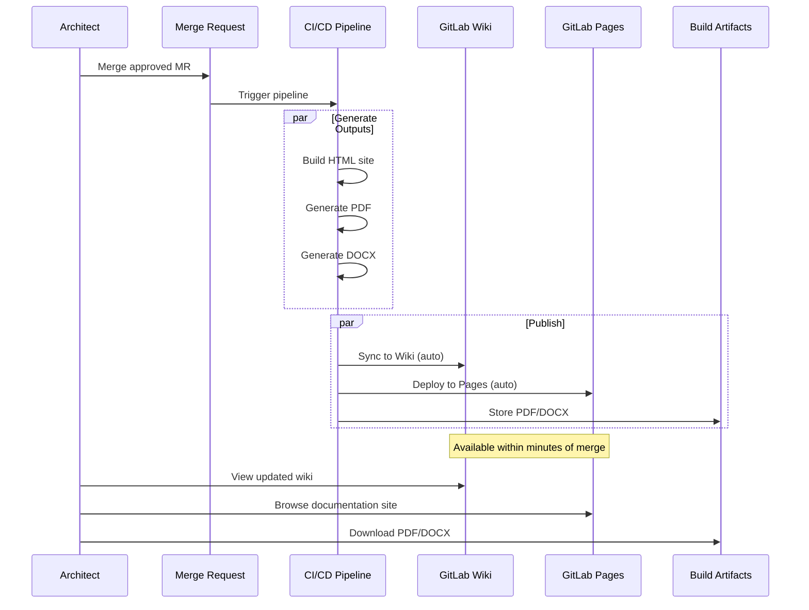

**Output Channels Comparison:**

| Channel             | Use Case                        | URL Pattern                   | Access Control         |
| ------------------- | ------------------------------- | ----------------------------- | ---------------------- |
| **GitLab Wiki**     | Quick reference, searchable     | `gitlab.com/project/wiki`     | Project members        |
| **GitLab Pages**    | Polished documentation site     | `namespace.gitlab.io/project` | Public or private      |
| **PDF Export**      | Formal distribution, printing   | Pipeline artifacts            | Download link          |
| **DOCX Export**     | Board presentations, editing    | Pipeline artifacts            | Download link          |
| **Confluence Sync** | Legacy system bridge (optional) | Via API                       | Confluence permissions |

**Advanced: Multi-Format Generation with MkDocs**

For a more polished documentation site, use MkDocs with Material theme:

```yaml
# mkdocs.yml
site_name: Techcombank Architecture
theme:
  name: material
  palette:
    primary: red
    accent: amber
  features:
    - navigation.tabs
    - navigation.sections
    - search.suggest
    - content.code.copy

plugins:
  - search
  - mermaid2
  - pdf-export:
      combined: true

nav:
  - Home: index.md
  - Domains:
      - Core Banking: domains/core-banking/README.md
      - Digital Channels: domains/digital-channels/README.md
      - Payments: domains/payments/README.md
  - Patterns:
      - Integration: patterns/integration/README.md
      - Security: patterns/security/README.md
  - Governance:
      - Design Approval Board: governance/design-approval-board/process.md
      - Architecture Decisions: governance/decisions/index.md
```

**CI/CD for MkDocs:**

```yaml
build-mkdocs:
  stage: build
  image: python:3.11
  script:
    - pip install mkdocs-material mkdocs-mermaid2-plugin mkdocs-pdf-export-plugin
    - mkdocs build --strict
  artifacts:
    paths:
      - site/
  rules:
    - if: $CI_COMMIT_BRANCH == "main"
```

**Key Benefits of Auto-Publishing:**

| Benefit                 | Description                                 |
| ----------------------- | ------------------------------------------- |
| **Zero Manual Effort**  | No export, upload, or sync required         |
| **Always Current**      | Wiki/site updated within minutes of merge   |
| **Version Consistency** | Published docs always match approved source |
| **Multiple Formats**    | One source → HTML, PDF, DOCX, Wiki          |
| **Audit Trail**         | Every publish linked to specific commit     |
| **Rollback Capability** | Revert to any previous version instantly    |

**Notification Integration:**

```yaml
notify-publish:
  stage: publish
  script:
    - |
      curl -X POST "$SLACK_WEBHOOK" \
        -H "Content-Type: application/json" \
        -d '{
          "text": "📚 Architecture documentation updated!",
          "blocks": [
            {
              "type": "section",
              "text": {
                "type": "mrkdwn",
                "text": "*Architecture Documentation Published*\n\n• <'"$PAGES_URL"'|View Documentation Site>\n• <'"$WIKI_URL"'|View Wiki>\n• <'"$PDF_URL"'|Download PDF>\n\nCommit: '"$CI_COMMIT_SHORT_SHA"' by '"$CI_COMMIT_AUTHOR"'"
              }
            }
          ]
        }'
  rules:
    - if: $CI_COMMIT_BRANCH == "main"
```

#### 5. Diagram-As-Code Standards

**MermaidJS for:**

- Flowcharts and process diagrams
- Sequence diagrams
- State diagrams
- Entity relationship diagrams
- GitGraph (for version history visualization)
- User journey maps

**Example Solution Architecture Diagram (Mermaid):**

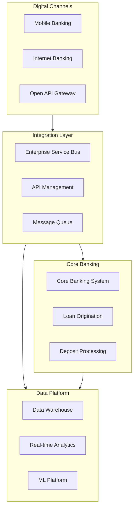

**PlantUML for:**

- Complex C4 model diagrams
- Detailed UML class/component diagrams
- Network topology diagrams
- Mind maps and organizational charts

> **GitLab Native Support:** Both MermaidJS and PlantUML are rendered natively in GitLab markdown files. Use ` ```plantuml ` code blocks for PlantUML diagrams.

**Example: C4 Context Diagram (PlantUML)**

```plantuml
@startuml C4_Context
!include https://raw.githubusercontent.com/plantuml-stdlib/C4-PlantUML/master/C4_Context.puml

title System Context Diagram - Techcombank Digital Banking

Person(customer, "Banking Customer", "A customer using digital banking services")
Person(staff, "Bank Staff", "Internal bank employees")

System(digitalBanking, "Digital Banking Platform", "Provides online and mobile banking services")

System_Ext(coreBank, "Core Banking System", "T24/Temenos - Account management and transactions")
System_Ext(payment, "Payment Gateway", "NAPAS/Visa/Mastercard integration")
System_Ext(credit, "Credit Bureau", "PCB/CIC credit scoring")
System_Ext(ekyc, "eKYC Provider", "Identity verification services")

Rel(customer, digitalBanking, "Uses", "HTTPS")
Rel(staff, digitalBanking, "Manages", "HTTPS")
Rel(digitalBanking, coreBank, "Reads/Writes", "API")
Rel(digitalBanking, payment, "Processes payments", "API")
Rel(digitalBanking, credit, "Checks credit", "API")
Rel(digitalBanking, ekyc, "Verifies identity", "API")

@enduml
```

**Example: C4 Container Diagram (PlantUML)**

```plantuml
@startuml C4_Container
!include https://raw.githubusercontent.com/plantuml-stdlib/C4-PlantUML/master/C4_Container.puml

title Container Diagram - Digital Banking Platform

Person(customer, "Customer", "Uses mobile and web banking")

System_Boundary(digitalPlatform, "Digital Banking Platform") {
    Container(mobileApp, "Mobile App", "React Native", "iOS and Android banking application")
    Container(webApp, "Web Application", "React", "Internet banking portal")
    Container(apiGateway, "API Gateway", "Kong", "Authentication, rate limiting, routing")
    Container(accountSvc, "Account Service", "Java/Spring Boot", "Account management and inquiries")
    Container(paymentSvc, "Payment Service", "Java/Spring Boot", "Payment processing and transfers")
    Container(notifSvc, "Notification Service", "Node.js", "Push, SMS, Email notifications")
    ContainerDb(accountDb, "Account DB", "PostgreSQL", "Account data and transactions")
    ContainerDb(cache, "Cache", "Redis", "Session and data caching")
    ContainerQueue(eventBus, "Event Bus", "Kafka", "Async event streaming")
}

System_Ext(coreBank, "Core Banking", "T24")

Rel(customer, mobileApp, "Uses", "HTTPS")
Rel(customer, webApp, "Uses", "HTTPS")
Rel(mobileApp, apiGateway, "API calls", "HTTPS/JSON")
Rel(webApp, apiGateway, "API calls", "HTTPS/JSON")
Rel(apiGateway, accountSvc, "Routes to", "gRPC")
Rel(apiGateway, paymentSvc, "Routes to", "gRPC")
Rel(accountSvc, accountDb, "Reads/Writes", "JDBC")
Rel(accountSvc, cache, "Caches", "Redis Protocol")
Rel(paymentSvc, eventBus, "Publishes", "Kafka")
Rel(notifSvc, eventBus, "Subscribes", "Kafka")
Rel(accountSvc, coreBank, "Syncs with", "API")

@enduml
```

**Example: Sequence Diagram (PlantUML)**

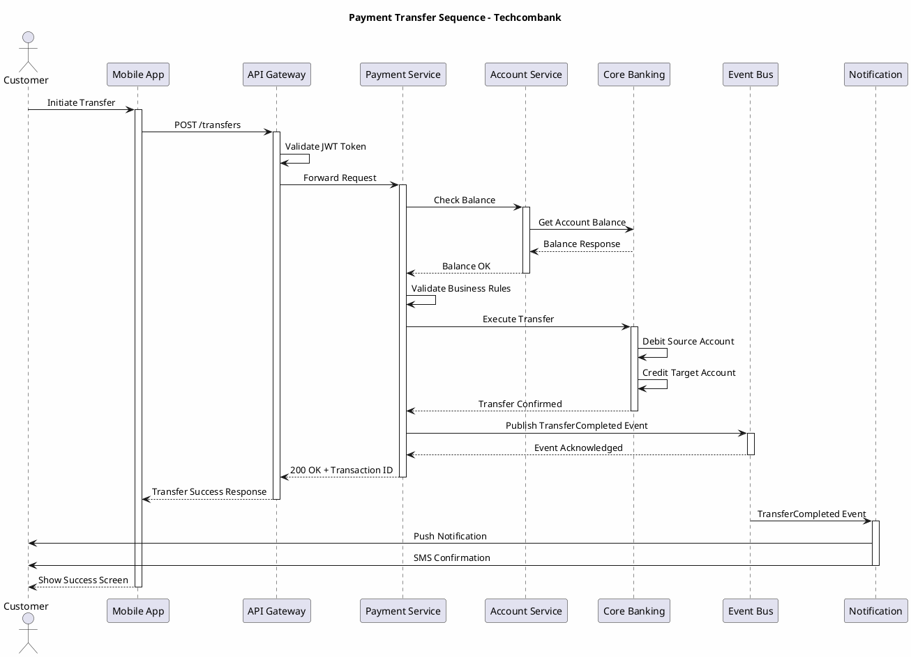

**Example: Component Diagram (PlantUML)**

```plantuml
@startuml Component_Diagram
!include https://raw.githubusercontent.com/plantuml-stdlib/C4-PlantUML/master/C4_Component.puml

title Component Diagram - Payment Service

Container_Boundary(paymentSvc, "Payment Service") {
    Component(controller, "Payment Controller", "Spring MVC", "REST API endpoints")
    Component(validator, "Payment Validator", "Java", "Business rule validation")
    Component(orchestrator, "Payment Orchestrator", "Java", "Coordinates payment flow")
    Component(domainSvc, "Domain Service", "Java", "Core payment logic")
    Component(antifraud, "Anti-Fraud Module", "Java", "Fraud detection rules")
    Component(repository, "Payment Repository", "Spring Data", "Data access layer")
    Component(eventPub, "Event Publisher", "Kafka Client", "Publishes domain events")
    Component(coreClient, "Core Banking Client", "REST Client", "Integration with T24")
}

Rel(controller, validator, "Validates via")
Rel(controller, orchestrator, "Delegates to")
Rel(orchestrator, antifraud, "Checks fraud")
Rel(orchestrator, domainSvc, "Executes")
Rel(domainSvc, repository, "Persists via")
Rel(domainSvc, coreClient, "Calls")
Rel(domainSvc, eventPub, "Publishes events")

@enduml
```

**Example: Class Diagram (PlantUML)**

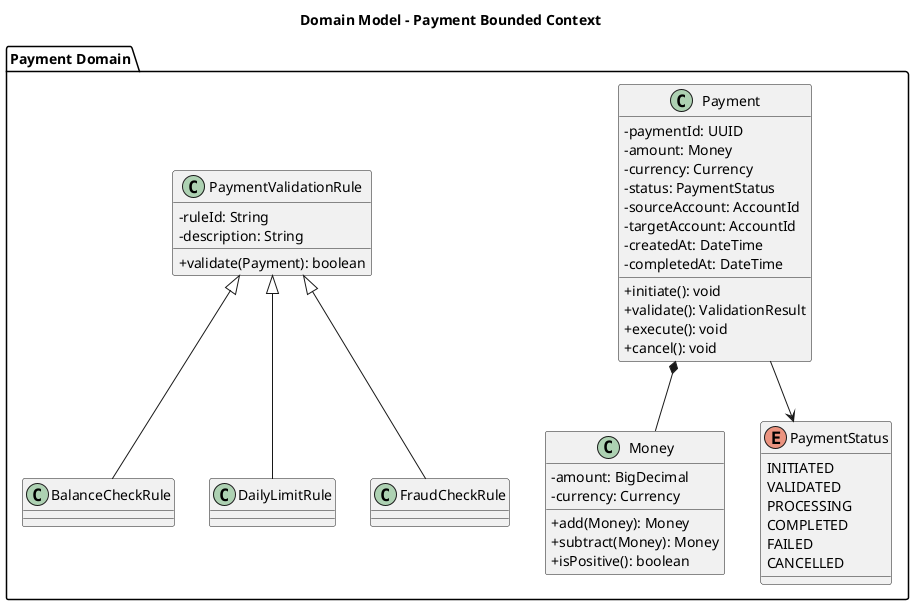

**Example: State Diagram (PlantUML)**

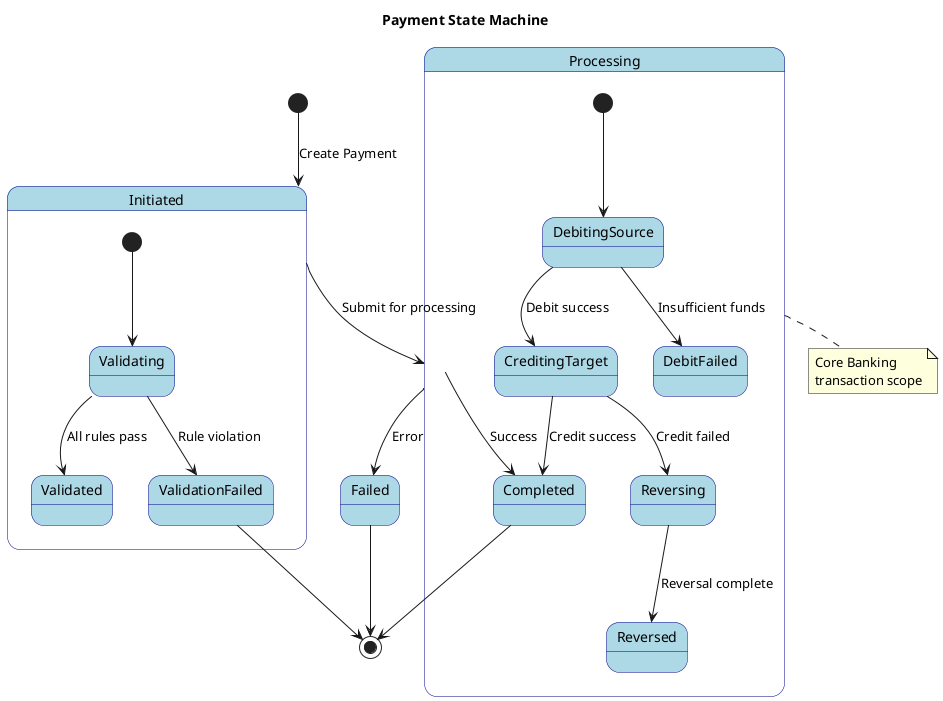

**Example: Deployment Diagram (PlantUML)**

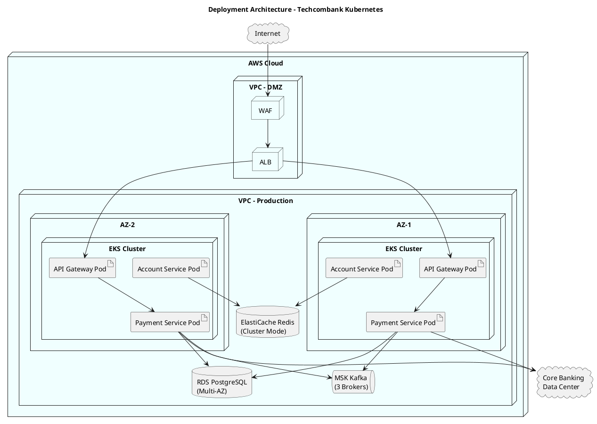

**Diagram Tool Selection Guide:**

| Diagram Type        | Recommended Tool | Rationale                                |
| ------------------- | ---------------- | ---------------------------------------- |
| Flowcharts          | MermaidJS        | Simpler syntax, quick iteration          |
| Sequence Diagrams   | PlantUML         | Better control over complex interactions |
| C4 Models           | PlantUML         | Dedicated C4 library with proper styling |
| State Machines      | Either           | Both work well                           |
| Class/Domain Models | PlantUML         | Full UML support                         |
| ER Diagrams         | MermaidJS        | Simpler for basic ERDs                   |
| Deployment          | PlantUML         | Better infrastructure visualization      |
| Mind Maps           | MermaidJS        | Native support                           |
| Gantt Charts        | MermaidJS        | Native support                           |
| Git Graphs          | MermaidJS        | Only available in Mermaid                |

**GitLab Rendering Configuration:**

To enable PlantUML rendering in GitLab, ensure the following in `gitlab.rb`:

```ruby
# /etc/gitlab/gitlab.rb
gitlab_rails['plantuml_enabled'] = true
gitlab_rails['plantuml_url'] = 'https://plantuml.example.com'
```

Or use the public PlantUML server (for non-sensitive diagrams):

```ruby
gitlab_rails['plantuml_url'] = 'https://www.plantuml.com/plantuml'
```

#### 6. Architecture Decision Records (ADR)

Each significant architecture decision is documented as a Markdown file:

```markdown
# ADR-001: Adopt MermaidJS as Primary Diagramming Tool

## Status

Accepted

## Context

The Enterprise Architecture team needs a standardized approach to
creating and maintaining architecture diagrams that supports version
control, collaboration, and AI integration.

## Decision

We will adopt MermaidJS as the primary diagramming tool for all
architecture documentation, with PlantUML as a secondary option for
complex UML requirements.

## Consequences

### Positive

- Native GitLab rendering without plugins
- Text-based format enables Git diff/merge
- AI tools can read and generate diagrams
- Lower barrier to entry for contributors

### Negative

- Less layout control than visual tools
- Learning curve for teams familiar with Drawio
- Some diagram types not supported

## Compliance

- Aligns with DevOps practices
- Supports BIAN documentation standards
```

---

## Tools Comparison

### Platform Comparison: Confluence vs GitLab

| Capability              | Confluence + Drawio | GitLab + Mermaid          | Winner     |
| ----------------------- | ------------------- | ------------------------- | ---------- |
| **Version Control**     | Page history only   | Full Git versioning       | GitLab     |
| **Diff/Merge**          | Not available       | Native support            | GitLab     |
| **Branching**           | Not available       | Full branching workflow   | GitLab     |
| **Approval Workflow**   | Comment-based       | Merge Request rules       | GitLab     |
| **Audit Trail**         | Basic               | Comprehensive             | GitLab     |
| **Search**              | Good (text only)    | Good (includes code)      | Tie        |
| **WYSIWYG Editing**     | Excellent           | Limited                   | Confluence |
| **Non-technical Users** | Easy                | Moderate learning curve   | Confluence |
| **AI Integration**      | Limited             | Excellent (MCP, llms.txt) | GitLab     |
| **CI/CD Integration**   | Via plugins         | Native                    | GitLab     |
| **Self-hosting**        | Available           | Available                 | Tie        |
| **Total Cost**          | Higher              | Lower                     | GitLab     |

### Diagramming Tools Comparison: MermaidJS vs PlantUML vs Drawio

| Feature               | MermaidJS    | PlantUML     | Drawio        |
| --------------------- | ------------ | ------------ | ------------- |
| **Learning Curve**    | Easy         | Moderate     | Easy (visual) |
| **GitLab Native**     | Yes          | Via includes | Via plugin    |
| **Browser Rendering** | Yes          | Via server   | Yes           |
| **Layout Control**    | Limited      | Extensive    | Full manual   |
| **C4 Model Support**  | Experimental | Excellent    | Via templates |
| **Sequence Diagrams** | Good         | Excellent    | Good          |
| **State Diagrams**    | Good         | Good         | Good          |
| **ER Diagrams**       | Good         | Good         | Good          |
| **Git Diff Friendly** | Excellent    | Excellent    | Poor (binary) |
| **AI Generatable**    | Excellent    | Good         | Poor          |
| **Customization**     | Limited      | Extensive    | Full          |

### Recommendation Matrix

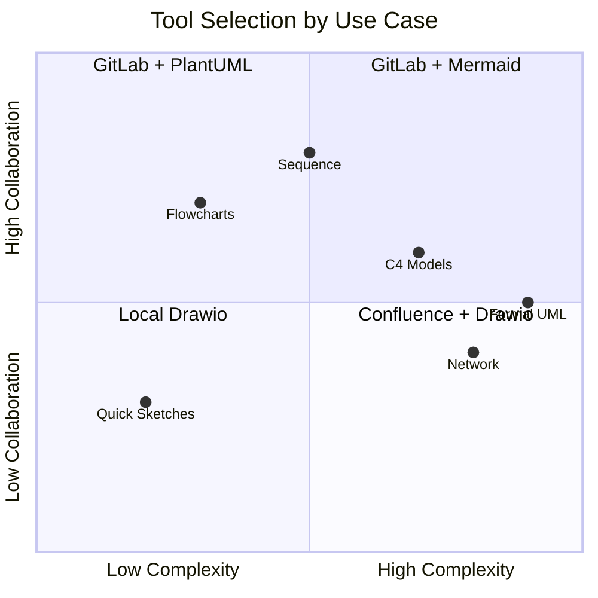

**Recommendation:**

- **Primary Tool:** MermaidJS for 80% of diagrams (flowcharts, sequences, ERDs)
- **Secondary Tool:** PlantUML for complex UML and C4 models
- **Transitional:** Drawio exports for legacy diagram migration

---

## Benefits Analysis

### 1. Operational Benefits

#### Version Control & Traceability

- **Full Git history** for every document and diagram change
- **Granular diff capability** showing exactly what changed between versions
- **Branch-based parallel work** enabling multiple architects to work simultaneously
- **Audit-ready trails** for regulatory compliance

#### Collaboration Efficiency

- **Structured code review process** via Merge Requests
- **Threaded discussions** tied to specific changes
- **Approval rules** enforcing governance requirements
- **Automated notifications** integrated with existing workflows

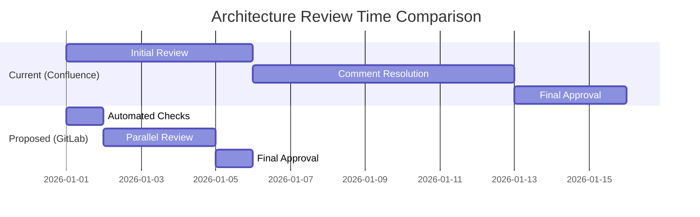

### 2. Quality Benefits

#### Documentation Accuracy

- **Living documentation** that stays synchronized with implementation
- **Automated validation** of diagram syntax and references
- **Cross-reference checking** ensuring consistency
- **Template enforcement** maintaining standards

#### Architecture Governance

- **Mandatory review gates** preventing unapproved changes
- **Security pattern validation** via CI/CD checks
- **Compliance automation** for banking regulations
- **Decision traceability** through ADRs

### 3. Strategic Benefits

#### Single Source of Truth - Write Once, Use Everywhere

**The most transformative benefit:** All architecture knowledge exists in ONE place and can be embedded anywhere.

| Current Pain                            | AaC Solution                                    | Impact                |
| --------------------------------------- | ----------------------------------------------- | --------------------- |
| Patterns copy-pasted into 50+ documents | Single definition, multiple references          | 100% consistency      |
| Updates require changing every copy     | Update once, automatically reflected everywhere | 90% less maintenance  |
| No visibility into what uses what       | Full dependency tracking via Git                | Complete traceability |
| Version drift across documents          | All references point to latest approved         | Zero drift            |
| Architects reinvent the wheel           | Searchable, reusable pattern library            | 60% faster design     |

#### AI Auto-Retrieval - Zero Manual Search

**Eliminates the "search and select" burden:** AI automatically pulls relevant patterns, standards, and prior art.

| Metric                             | Manual Process | AI-Enabled | Improvement     |
| ---------------------------------- | -------------- | ---------- | --------------- |
| Time to find relevant patterns     | 2-4 hours      | Instant    | 95% reduction   |
| Patterns missed per design         | 2-3 on average | Near zero  | 90% reduction   |
| Consistency across designs         | 60-70%         | 95%+       | 35% improvement |
| Onboarding time for new architects | 3-6 months     | 1-2 months | 60% reduction   |

#### AI/GenAI Readiness

```mermaid
flowchart LR
    subgraph AaC["Architecture-As-Code"]
        MD[Markdown Docs]
        MERM[Mermaid Diagrams]
        ADR[Decision Records]
    end

    subgraph AI["AI Integration"]
        LLMS[llms.txt Index]
        MCP[Model Context Protocol]
        RAG[RAG Pipeline]
    end

    subgraph Capabilities["AI Capabilities"]
        GEN[Generate Diagrams]
        REV[Review Architecture]
        QA[Answer Questions]
        DOC[Auto-document]
    end

    AaC --> AI
    AI --> Capabilities
```

**AI-Enabled Capabilities:**

- **Automated diagram generation** from natural language descriptions
- **Architecture review assistance** identifying patterns and anti-patterns
- **Documentation Q&A** enabling conversational architecture queries
- **Auto-documentation** keeping docs synchronized with code changes

#### DevOps Integration

- **Same toolchain** as development teams (GitLab)
- **CI/CD pipelines** for documentation validation and publishing
- **Infrastructure alignment** with Infrastructure-as-Code practices
- **Unified workflow** reducing context switching

### 4. Quantified Operational Benefits

| Benefit Category              | Current State                | With AaC                  | Improvement     |
| ----------------------------- | ---------------------------- | ------------------------- | --------------- |
| **Architecture Review Cycle** | 10-15 business days          | 3-5 business days         | 50-60% faster   |
| **Documentation Updates**     | Manual, 2-4 hours per doc    | Auto-propagated           | 90% less effort |
| **Design Rework**             | 3-4 iterations average       | 1-2 iterations            | 50% reduction   |
| **Compliance Audit Prep**     | 2-3 weeks manual compilation | Instant report generation | 80% faster      |
| **New Architect Onboarding**  | 3-6 months to productivity   | 1-2 months with AI assist | 60% faster      |
| **Pattern Discovery**         | 2-4 hours manual search      | Instant AI retrieval      | 95% faster      |
| **Cross-Team Consistency**    | 60-70% pattern adherence     | 95%+ with enforcement     | 35% improvement |
| **Documentation Currency**    | 40-50% outdated              | 95%+ current              | Near real-time  |

---

## GenAI & AI Opportunities

### The AI Documentation Revolution

By 2026, documentation is evolving from static content to adaptive systems that actively think, adapt, and keep humans in the loop. Architecture-As-Code positions Techcombank to fully leverage this transformation.

### AI Integration Architecture

```mermaid
flowchart TB
    subgraph Sources["Architecture Sources"]
        REPO[GitLab Repository]
        CODE[Application Code]
        CONFIG[Configuration]
        COMMITS[Commit History]
    end

    subgraph Context["Context Layer"]
        LLMS[llms.txt]
        INDEX[Vector Index]
        META[Metadata Store]
    end

    subgraph AI["AI Processing"]
        LLM[Large Language Model]
        AGENT[AI Agent]
        MCP2[MCP Server]
    end

    subgraph Apps["Applications"]
        CHAT[Architecture Chatbot]
        GEN2[Diagram Generator]
        REV2[Review Assistant]
        DOC2[Doc Generator]
    end

    Sources --> Context
    Context --> AI
    AI --> Apps
```

### The AI Knowledge Base Server: Zero-Search Architecture Intelligence

**This is the game-changer.** With Architecture-As-Code, the entire GitLab repository becomes an AI-consumable knowledge base. AI assistants can **automatically retrieve relevant content** - architects no longer need to manually search, select, and copy-paste information.

```mermaid
flowchart TB
    subgraph Traditional["Traditional Workflow (Manual)"]
        direction LR
        T1[Architect has question] --> T2[Search Confluence]
        T2 --> T3[Browse 50+ pages]
        T3 --> T4[Find relevant content]
        T4 --> T5[Copy-paste into design]
        T5 --> T6[Hope it's current version]
    end

    subgraph AIEnabled["AI-Enabled Workflow (Automatic)"]
        direction LR
        A1[Architect asks AI] --> A2[AI queries Knowledge Base]
        A2 --> A3[Vector search + semantic understanding]
        A3 --> A4[Auto-retrieve relevant patterns]
        A4 --> A5[Generate compliant design]
        A5 --> A6[Guaranteed current version]
    end

    Traditional -.->|Transform| AIEnabled

    style Traditional fill:#ffebee
    style AIEnabled fill:#e8f5e9
```

#### How the AI Knowledge Base Works

```mermaid
flowchart LR
    subgraph Ingestion["1. Knowledge Ingestion"]
        REPO[GitLab Repository]
        PARSE[Document Parser]
        CHUNK[Smart Chunking]
        EMBED[Vector Embeddings]

        REPO --> PARSE
        PARSE --> CHUNK
        CHUNK --> EMBED
    end

    subgraph Storage["2. Knowledge Storage"]
        VDB[(Vector Database)]
        META[(Metadata Index)]
        GRAPH[(Knowledge Graph)]

        EMBED --> VDB
        EMBED --> META
        META --> GRAPH
    end

    subgraph Retrieval["3. Intelligent Retrieval"]
        QUERY[User Query]
        SEM[Semantic Search]
        RANK[Relevance Ranking]
        CTX[Context Assembly]

        QUERY --> SEM
        SEM --> VDB
        VDB --> RANK
        RANK --> CTX
    end

    subgraph Response["4. AI Response"]
        LLM2[LLM Processing]
        GEN[Generate Response]
        CITE[Add Citations]

        CTX --> LLM2
        LLM2 --> GEN
        GEN --> CITE
    end
```

#### AI Auto-Retrieval Capabilities

| User Request                                        | AI Automatically Retrieves                                                                              | Without AI (Manual Effort)          |
| --------------------------------------------------- | ------------------------------------------------------------------------------------------------------- | ----------------------------------- |
| "Design a new payment API"                          | Integration patterns, security standards, API guidelines, existing payment services, naming conventions | 2-4 hours searching and reading     |
| "What's our approach to event-driven architecture?" | Event sourcing patterns, message queue standards, existing implementations, ADRs                        | 1-2 hours across multiple docs      |
| "Create a solution design for customer onboarding"  | Similar designs, compliance requirements, security patterns, data models, integration points            | 4-6 hours research                  |
| "Is this design compliant with our standards?"      | All applicable standards, checklists, anti-patterns to avoid                                            | Manual review against 20+ documents |

#### Knowledge Base Server Architecture

```mermaid
flowchart TB
    subgraph GitLab["GitLab Repository (Source of Truth)"]
        ARCH[Architecture Docs]
        PATT[Design Patterns]
        PRIN[Principles]
        ADR[Decision Records]
        DIAG[Diagrams]
    end

    subgraph KBServer["AI Knowledge Base Server"]
        SYNC[Real-time Sync<br/>via Webhooks]
        INDEX[Intelligent Indexer]
        VEC[Vector Store<br/>Embeddings]
        KG[Knowledge Graph<br/>Relationships]
        CACHE[Response Cache]

        SYNC --> INDEX
        INDEX --> VEC
        INDEX --> KG
    end

    subgraph AILayer["AI Service Layer"]
        MCP3[MCP Server]
        RAG2[RAG Pipeline]
        AGENT2[AI Agents]
    end

    subgraph Interfaces["User Interfaces"]
        CHAT2[Architecture Chatbot]
        IDE[IDE Plugin]
        SLACK[Slack Bot]
        WEB2[Web Portal]
        API2[API Gateway]
    end

    GitLab -->|Webhook| KBServer
    KBServer --> AILayer
    AILayer --> Interfaces
```

#### Key Benefits of AI Knowledge Base

| Benefit                       | Description                                                | Impact                             |
| ----------------------------- | ---------------------------------------------------------- | ---------------------------------- |
| **Zero Search Time**          | AI retrieves relevant content automatically                | 80% reduction in research time     |
| **Complete Context**          | AI assembles all related information in one response       | No missed dependencies             |
| **Always Current**            | Real-time sync ensures latest approved versions            | Zero documentation drift           |
| **Semantic Understanding**    | AI understands intent, not just keywords                   | Better, more relevant results      |
| **Cross-Reference Discovery** | AI finds connections humans might miss                     | Improved design quality            |
| **Consistent Application**    | Same patterns applied uniformly across all designs         | Enterprise-wide consistency        |
| **Institutional Memory**      | AI retains and surfaces historical decisions and rationale | Preserves organizational knowledge |

#### Example: AI-Assisted Design Session

```
┌─────────────────────────────────────────────────────────────────────────────┐
│ ARCHITECT: I need to design a new microservice for loan origination.       │
│            What patterns and standards should I follow?                     │
├─────────────────────────────────────────────────────────────────────────────┤
│ AI ASSISTANT: Based on your architecture repository, here's what applies:  │
│                                                                             │
│ 📋 APPLICABLE PATTERNS (auto-retrieved):                                   │
│ • /patterns/microservices/service-template.md - Standard service structure │
│ • /patterns/integration/api-gateway.md - API design guidelines             │
│ • /patterns/data/event-sourcing.md - For loan state management             │
│ • /patterns/security/oauth2-mtls.md - Service authentication               │
│                                                                             │
│ 📐 ARCHITECTURE PRINCIPLES (auto-retrieved):                               │
│ • AP-001: API-First Design                                                  │
│ • AP-007: Event-Driven Integration                                          │
│ • AP-012: Zero-Trust Security Model                                         │
│                                                                             │
│ 📝 RELEVANT ADRs (auto-retrieved):                                         │
│ • ADR-045: Use of Kafka for inter-service messaging                        │
│ • ADR-052: PostgreSQL for transactional data                               │
│                                                                             │
│ 🔗 SIMILAR IMPLEMENTATIONS (auto-retrieved):                               │
│ • /domains/core-banking/account-service/ - Similar service structure       │
│ • /domains/payments/payment-service/ - Integration patterns reference      │
│                                                                             │
│ Would you like me to generate a solution design template with these        │
│ patterns pre-embedded?                                                      │
└─────────────────────────────────────────────────────────────────────────────┘
```

### Key AI Capabilities

#### 1. llms.txt for Architecture Context

Create an `llms.txt` file as the AI-readable index of architecture documentation:

```markdown
# Techcombank Architecture Documentation

> This repository contains the official architecture documentation
> for Techcombank's enterprise systems. It follows Architecture-As-Code
> principles and BIAN banking framework standards.

## Core Documentation

- [Enterprise Architecture Overview](/docs/overview.md): High-level view of all domains
- [Domain Catalog](/domains/): Business domain architecture documents
- [Integration Patterns](/patterns/integration/): Standard integration approaches
- [Security Architecture](/patterns/security/): Security standards and patterns
- [Architecture Decisions](/governance/decisions/): All ADRs with rationale

## Diagram Standards

- [Mermaid Conventions](/governance/standards/mermaid.md): Mermaid diagram guidelines
- [C4 Model Templates](/templates/c4/): Context, Container, Component templates

## For AI Assistants

When generating architecture documentation:

1. Follow BIAN service domain naming conventions
2. Use Mermaid for flowcharts and sequences
3. Use PlantUML for C4 models
4. Reference existing patterns before creating new ones
5. Include ADR for significant decisions
```

#### 2. Model Context Protocol (MCP) Integration

MCP servers enable AI tools to interact with architecture repositories in real-time:

**Capabilities:**

- Read and understand existing architecture documentation
- Generate new diagrams based on requirements
- Check proposed changes against established patterns
- Answer questions about system architecture
- Identify dependencies and impacts

**Example Workflow:**

```mermaid
sequenceDiagram
    participant Arch as Architect
    participant AI as AI Assistant
    participant MCP as MCP Server
    participant Repo as GitLab Repo

    Arch->>AI: "Create integration diagram for payment service"
    AI->>MCP: Request context
    MCP->>Repo: Fetch llms.txt, patterns, existing diagrams
    Repo-->>MCP: Architecture context
    MCP-->>AI: Structured context
    AI->>AI: Generate Mermaid diagram
    AI-->>Arch: Proposed diagram + explanation
    Arch->>Repo: Create MR with diagram
```

#### 3. Automated Architecture Documentation

**Auto-generation Capabilities:**

- Convert code structure to architecture diagrams
- Generate component documentation from code comments
- Create sequence diagrams from trace data
- Update capacity models from monitoring data

**Example: Auto-generated from Code Analysis**

```mermaid
flowchart LR
    subgraph Auto["Auto-Generated View"]
        direction TB
        SVC1[Payment Service]
        SVC2[Account Service]
        SVC3[Notification Service]
        DB1[(Payment DB)]
        DB2[(Account DB)]
        Q1[Event Queue]

        SVC1 --> DB1
        SVC1 --> Q1
        Q1 --> SVC2
        Q1 --> SVC3
        SVC2 --> DB2
    end
```

#### 4. AI-Assisted Architecture Review

```mermaid
flowchart TB
    MR[Merge Request Submitted]
    AI_REVIEW[AI Review Agent]

    MR --> AI_REVIEW

    AI_REVIEW --> CHECK1{Pattern Compliance?}
    AI_REVIEW --> CHECK2{Security Standards?}
    AI_REVIEW --> CHECK3{BIAN Alignment?}
    AI_REVIEW --> CHECK4{Completeness?}

    CHECK1 -->|Issues| COMMENT1[Add Review Comment]
    CHECK2 -->|Issues| COMMENT2[Add Security Flag]
    CHECK3 -->|Issues| COMMENT3[Add Compliance Note]
    CHECK4 -->|Issues| COMMENT4[Add Checklist Items]

    CHECK1 -->|OK| APPROVE1[Pattern Approved]
    CHECK2 -->|OK| APPROVE2[Security Approved]
    CHECK3 -->|OK| APPROVE3[Compliance Approved]
    CHECK4 -->|OK| APPROVE4[Complete Approved]
```

### AI Tools Roadmap

| Phase       | Timeline | Capability              | Tools                      |
| ----------- | -------- | ----------------------- | -------------------------- |
| **Phase 1** | Q1 2026  | llms.txt implementation | GitLab, Custom scripts     |
| **Phase 2** | Q2 2026  | Diagram generation      | Claude/GPT + MCP           |
| **Phase 3** | Q3 2026  | Automated review        | Custom AI agents           |
| **Phase 4** | Q4 2026  | Full context engine     | RAG pipeline + MCP servers |

### Expected AI Benefits

| Capability         | Efficiency Gain        | Quality Impact   |
| ------------------ | ---------------------- | ---------------- |
| Diagram Generation | 60-70% faster creation | Consistent style |
| Architecture Q&A   | 80% query resolution   | Reduced meetings |
| Review Assistance  | 40% faster reviews     | Fewer defects    |
| Auto-documentation | 50% less maintenance   | Always current   |

---

## Value Analysis

### Core Value Drivers

Architecture-As-Code delivers value across five key dimensions that transform how the Enterprise Architecture team operates.

```mermaid
mindmap
  root((AaC Value))
    Velocity
      50-60% faster reviews
      Parallel approvals
      Auto-publishing
    Quality
      100% consistency
      Zero documentation drift
      Automated validation
    Intelligence
      AI auto-retrieval
      Semantic search
      Pattern suggestions
    Governance
      Enforced approvals
      Full audit trail
      Compliance automation
    Collaboration
      Git-based workflow
      Cross-team visibility
      Real-time sync
```

### Value Driver 1: Architecture Review Velocity

| Metric                  | Current State             | With AaC                        | Impact              |
| ----------------------- | ------------------------- | ------------------------------- | ------------------- |
| End-to-end review cycle | 10-15 business days       | 3-5 business days               | **60% faster**      |
| Reviewer assignment     | Manual email coordination | Auto-assigned via CODEOWNERS    | **Instant**         |
| Parallel reviews        | Not possible              | Security + Domain simultaneous  | **50% time saved**  |
| Change visibility       | "View history" - no diff  | Line-by-line diff with comments | **Clear context**   |
| Approval tracking       | Scattered in comments     | Dashboard with SLA metrics      | **Full visibility** |

### Value Driver 2: Single Source of Truth

| Metric                 | Current State             | With AaC                 | Impact                    |
| ---------------------- | ------------------------- | ------------------------ | ------------------------- |
| Pattern consistency    | 60-70% adherence          | 95%+ with references     | **35% improvement**       |
| Update propagation     | Manual across 50+ docs    | Automatic everywhere     | **Zero effort**           |
| Documentation currency | 40-50% outdated           | 95%+ current             | **Near real-time**        |
| Dependency visibility  | None                      | Full Git tracking        | **Complete traceability** |
| Duplicate content      | High (copy-paste culture) | None (single definition) | **100% reduction**        |

### Value Driver 3: AI-Powered Knowledge Discovery

| Metric                     | Current State       | With AaC                    | Impact               |
| -------------------------- | ------------------- | --------------------------- | -------------------- |
| Time to find patterns      | 2-4 hours searching | Instant AI retrieval        | **95% faster**       |
| Patterns missed per design | 2-3 average         | Near zero                   | **90% reduction**    |
| Context assembly           | Manual, incomplete  | AI-assembled, comprehensive | **Complete context** |
| Historical decision access | Buried in pages     | AI-surfaced ADRs            | **Instant recall**   |
| New architect productivity | 3-6 months ramp-up  | 1-2 months with AI assist   | **60% faster**       |

### Value Driver 4: Governance & Compliance

| Metric                       | Current State               | With AaC                    | Impact               |
| ---------------------------- | --------------------------- | --------------------------- | -------------------- |
| Approval enforcement         | None - anyone can "approve" | Configurable blocking rules | **100% enforced**    |
| Audit trail completeness     | Basic page history          | Who, when, what, why        | **Full compliance**  |
| Compliance report generation | 2-3 weeks manual            | Instant from Git history    | **Automated**        |
| Security review tracking     | Manual spreadsheet          | Built-in approval workflow  | **Real-time status** |
| Regulatory evidence          | Manual compilation          | Auto-generated reports      | **Audit-ready**      |

### Value Driver 5: Collaboration & DevOps Alignment

| Metric                   | Current State           | With AaC                        | Impact                |
| ------------------------ | ----------------------- | ------------------------------- | --------------------- |
| Toolchain consistency    | Separate from dev teams | Same GitLab platform            | **Unified workflow**  |
| Review feedback          | Scattered comments      | Threaded, trackable discussions | **Clear resolution**  |
| Cross-team visibility    | Limited to page access  | Repository-wide search          | **Full transparency** |
| Documentation publishing | Manual export/upload    | Auto-publish on merge           | **Zero effort**       |
| Version rollback         | Complex page restore    | Git revert (one command)        | **Instant recovery**  |

### Capability Comparison Summary

```mermaid
radar
    title Capability Comparison: Current vs Proposed
    "Review Speed" : 3, 9
    "Consistency" : 4, 10
    "AI Readiness" : 1, 9
    "Governance" : 3, 10
    "Collaboration" : 5, 9
    "Automation" : 2, 9
```

| Capability             | Confluence + Drawio | GitLab + AaC              | Winner     |
| ---------------------- | ------------------- | ------------------------- | ---------- |
| Version Control        | Basic page history  | Full Git versioning       | **AaC**    |
| Branching/Merging      | Not available       | Native support            | **AaC**    |
| Multi-Level Approval   | Not enforceable     | Configurable rules        | **AaC**    |
| Diagram-as-Code        | Plugin dependency   | Native rendering          | **AaC**    |
| AI Integration         | Limited             | Full MCP/RAG support      | **AaC**    |
| Auto-Publishing        | Manual              | CI/CD pipeline            | **AaC**    |
| Single Source of Truth | Copy-paste          | References/Includes       | **AaC**    |
| Audit Compliance       | Manual reports      | Auto-generated            | **AaC**    |
| WYSIWYG Editing        | Excellent           | Markdown (learning curve) | Confluence |
| Non-Technical Users    | Easy                | Moderate                  | Confluence |

> **Bottom Line:** Architecture-As-Code transforms the EA team from document managers to knowledge curators, with AI-powered discovery, enforced governance, and DevOps-aligned workflows.

---

## Migration Strategy

### Migration Phases

```mermaid
gantt
    title Architecture-As-Code Migration Timeline
    dateFormat  YYYY-MM

    section Phase 1: Foundation
    GitLab Setup & Config    :p1a, 2026-03, 1M
    Standards Development    :p1b, 2026-03, 2M
    Training Program         :p1c, 2026-04, 2M
    Pilot Domain Selection   :p1d, 2026-04, 1M

    section Phase 2: Pilot
    Pilot Migration          :p2a, 2026-05, 2M
    Workflow Refinement      :p2b, 2026-06, 1M
    Pilot Review & Adjust    :p2c, 2026-07, 1M

    section Phase 3: Expansion
    Domain 2-3 Migration     :p3a, 2026-08, 2M
    Domain 4-6 Migration     :p3b, 2026-10, 2M
    Full Team Onboarding     :p3c, 2026-09, 3M

    section Phase 4: Optimization
    AI Integration           :p4a, 2026-11, 2M
    Confluence Sunset        :p4b, 2026-12, 1M
    Continuous Improvement   :p4c, 2026-12, 3M
```

### Phase Details

#### Phase 1: Foundation (Months 1-3)

**Objectives:**

- Establish GitLab repository structure
- Define standards and templates
- Train core team
- Select pilot domain

**Deliverables:**

- [ ] GitLab repository created and configured
- [ ] Contribution guidelines documented
- [ ] Mermaid/PlantUML standards defined
- [ ] ADR template created
- [ ] CI/CD pipeline for validation
- [ ] Training materials developed
- [ ] Core team certified (10-15 architects)

**Success Criteria:**

- 100% core team can create/review MRs
- All templates validated by stakeholders
- CI/CD pipeline operational

#### Phase 2: Pilot (Months 3-5)

**Objectives:**

- Migrate one complete domain
- Validate workflow end-to-end
- Gather feedback and refine

**Pilot Domain Selection Criteria:**

- Moderate complexity (50-100 documents)
- Active development/changes
- Engaged domain architect
- Representative patterns

**Recommended Pilot:** Digital Channels or Payments domain

**Deliverables:**

- [ ] All domain documents migrated
- [ ] All diagrams converted to Mermaid/PlantUML
- [ ] 3+ architecture reviews completed via MR
- [ ] Feedback collected and analyzed
- [ ] Process refinements documented

**Success Criteria:**

- 90% stakeholder satisfaction
- Review cycle time reduced by 30%+
- Zero critical issues in migration

#### Phase 3: Expansion (Months 5-9)

**Objectives:**

- Migrate remaining domains
- Onboard full architecture team
- Establish operating rhythm

**Migration Sequence:**

1. Core Banking (highest complexity)
2. Risk Management
3. Data Platform
4. Integration Services
5. Support Functions

**Deliverables:**

- [ ] All domains migrated
- [ ] All architects trained
- [ ] Operating procedures finalized
- [ ] Metrics dashboard operational

**Success Criteria:**

- 100% architecture documentation in GitLab
- All architects using new workflow
- Measurable efficiency improvements

#### Phase 4: Optimization (Months 9-12)

**Objectives:**

- Implement AI integration
- Sunset Confluence architecture spaces
- Establish continuous improvement

**Deliverables:**

- [ ] llms.txt implemented
- [ ] AI review assistant deployed
- [ ] Confluence read-only archive
- [ ] Quarterly review process established

**Success Criteria:**

- AI tools operational
- No new content in Confluence
- Continuous improvement backlog active

### Migration Approach by Content Type

| Content Type             | Migration Approach               | Effort      |
| ------------------------ | -------------------------------- | ----------- |
| **Text Documentation**   | Copy/paste + Markdown formatting | Low         |
| **Drawio Diagrams**      | Recreate in Mermaid/PlantUML     | Medium-High |
| **PlantUML (existing)**  | Direct copy                      | Low         |
| **MermaidJS (existing)** | Direct copy                      | Low         |
| **Tables**               | Convert to Markdown tables       | Low         |
| **Embedded Files**       | Store in repository              | Low         |
| **Comments/History**     | Archive, don't migrate           | N/A         |

### Diagram Conversion Guidelines

**Drawio to Mermaid Conversion:**

```
Drawio Shape          → Mermaid Equivalent
─────────────────────────────────────────────
Rectangle            → node[Label]
Rounded Rectangle    → node(Label)
Diamond              → node{Label}
Circle               → node((Label))
Cylinder             → node[(Database)]
Arrow                → --> or ---
Swimlane             → subgraph
```

**Example Conversion:**

_Before (Drawio - conceptual):_

```
[Box: User] --arrow--> [Box: API Gateway] --arrow--> [Cylinder: Database]
```

_After (Mermaid):_

```mermaid
flowchart LR
    User[User] --> API[API Gateway]
    API --> DB[(Database)]
```

---

## Risk Assessment

### Risk Matrix

```mermaid
quadrantChart
    title Risk Assessment Matrix
    x-axis Low Impact --> High Impact
    y-axis Low Likelihood --> High Likelihood

    quadrant-1 Monitor
    quadrant-2 Mitigate Actively
    quadrant-3 Accept
    quadrant-4 Contingency Plan

    "Adoption Resistance": [0.7, 0.6]
    "Skill Gap": [0.5, 0.7]
    "Migration Data Loss": [0.8, 0.2]
    "Tool Limitations": [0.4, 0.5]
    "Schedule Overrun": [0.5, 0.5]
    "AI Integration Issues": [0.3, 0.4]
```

### Detailed Risk Analysis

| Risk                           | Likelihood  | Impact | Mitigation                                                         | Owner           |
| ------------------------------ | ----------- | ------ | ------------------------------------------------------------------ | --------------- |
| **User Adoption Resistance**   | High        | High   | Change management program, champion network, executive sponsorship | Change Lead     |
| **Skill Gap in Markdown/Git**  | Medium-High | Medium | Training program, pair programming, reference guides               | Training Lead   |
| **Diagram Recreation Effort**  | Medium      | Medium | Prioritize high-value diagrams, accept simplified versions         | Migration Lead  |
| **Tool Capability Gaps**       | Medium      | Medium | PlantUML as backup, custom CI/CD extensions                        | Technical Lead  |
| **Schedule Overrun**           | Medium      | Medium | Buffer time in plan, phased approach                               | Project Manager |
| **Data Loss During Migration** | Low         | High   | Backup procedures, validation checklists                           | Migration Lead  |
| **GitLab Availability**        | Low         | High   | HA configuration, backup repository                                | Infrastructure  |
| **AI Integration Complexity**  | Medium      | Low    | Phased approach, start with llms.txt                               | AI Lead         |

### Risk Mitigation Strategies

#### High Priority Risks

**1. User Adoption Resistance**

_Mitigation Plan:_

- Executive sponsorship from CTO/CIO
- Architecture community champions (2 per domain)
- Gamification of adoption metrics
- Success story sharing
- Option to propose improvements

**2. Skill Gap**

_Mitigation Plan:_

- 3-tier training program (basic/intermediate/advanced)
- Self-service learning portal
- Office hours with experts
- Pair programming for first MRs
- Quick reference cards

### Contingency Plans

| Trigger                             | Contingency Action                             |
| ----------------------------------- | ---------------------------------------------- |
| Pilot fails success criteria        | Extend pilot 1 month, address root causes      |
| Migration effort 50%+ over estimate | Reduce scope, prioritize critical domains      |
| Critical GitLab outage              | Temporary return to Confluence for new content |
| AI integration blocked              | Proceed without AI, revisit in 6 months        |

---

## Change Management Plan

### Stakeholder Analysis

```mermaid
quadrantChart
    title Stakeholder Mapping
    x-axis Low Influence --> High Influence
    y-axis Against --> Supportive

    quadrant-1 Keep Satisfied
    quadrant-2 Manage Closely
    quadrant-3 Monitor
    quadrant-4 Keep Informed

    "Enterprise Architects": [0.8, 0.8]
    "Solution Architects": [0.6, 0.5]
    "Development Teams": [0.5, 0.7]
    "Project Managers": [0.4, 0.4]
    "Security Team": [0.7, 0.6]
    "IT Operations": [0.3, 0.5]
    "Business Stakeholders": [0.6, 0.3]
```

### Communication Plan

| Audience                  | Message Focus                            | Channel              | Frequency  |
| ------------------------- | ---------------------------------------- | -------------------- | ---------- |
| **Executive Leadership**  | ROI, strategic value, progress           | Steering committee   | Monthly    |
| **Enterprise Architects** | Technical details, standards, governance | Working group        | Weekly     |
| **Solution Architects**   | How-to, templates, support               | Team meetings, Slack | Continuous |
| **Development Teams**     | Integration, collaboration benefits      | Guild meetings       | Bi-weekly  |
| **Business Stakeholders** | Faster delivery, better quality          | Newsletter           | Monthly    |

### Training Program

#### Training Tiers

**Tier 1: Awareness (All Staff) - 1 hour**

- What is Architecture-As-Code
- Why we're making this change
- What it means for you

**Tier 2: User Training (Architects) - 4 hours**

- GitLab basics (repos, branches, MRs)
- Markdown fundamentals
- MermaidJS diagram creation
- Review and approval workflow
- Hands-on exercises

**Tier 3: Advanced Training (Core Team) - 8 hours**

- PlantUML for complex diagrams
- CI/CD pipeline customization
- Template development
- AI integration basics
- Troubleshooting

### Adoption Metrics

| Metric                           | Target (Month 3) | Target (Month 6) | Target (Month 12) |
| -------------------------------- | ---------------- | ---------------- | ----------------- |
| Active GitLab users (architects) | 50%              | 90%              | 100%              |
| MRs created per month            | 20               | 50               | 100+              |
| Average review cycle time        | 5 days           | 3 days           | 2 days            |
| Documentation currency           | 70%              | 85%              | 95%               |
| User satisfaction score          | 3.5/5            | 4.0/5            | 4.5/5             |

### Change Champions Network

**Structure:**

- 1 Executive Sponsor (VP/Director level)
- 1 Program Lead
- 2 Champions per business domain
- Technical support team (2-3 experts)

**Champion Responsibilities:**

- Promote adoption within domain
- Provide first-line support
- Collect feedback
- Identify training needs
- Celebrate successes

---

## Implementation Roadmap

### 12-Month Roadmap Overview

```mermaid
timeline
    title Architecture-As-Code Implementation Roadmap

    section Q1 2026
        Month 1 : Foundation Setup
                : GitLab configuration
                : Standards development
        Month 2 : Training Launch
                : Core team certification
                : Pilot domain selection
        Month 3 : Pilot Kickoff
                : First domain migration
                : Workflow validation

    section Q2 2026
        Month 4 : Pilot Expansion
                : Complete pilot migration
                : Feedback incorporation
        Month 5 : Phase 2 Start
                : Second domain migration
                : Broader team training
        Month 6 : Accelerated Migration
                : Domains 3-4 migration
                : Process refinement

    section Q3 2026
        Month 7 : Full Expansion
                : Remaining domains
                : Full team onboarding
        Month 8 : AI Foundation
                : llms.txt implementation
                : MCP exploration
        Month 9 : Stabilization
                : Process optimization
                : Metrics baseline

    section Q4 2026
        Month 10 : AI Integration
                 : Review assistant pilot
                 : Diagram generation
        Month 11 : Confluence Sunset
                 : Read-only archive
                 : Final migration
        Month 12 : Optimization
                 : Continuous improvement
                 : 2027 planning
```

### Key Milestones

| Milestone               | Target Date  | Success Criteria                                 |
| ----------------------- | ------------ | ------------------------------------------------ |
| M1: GitLab Ready        | End Month 1  | Repository structure, CI/CD pipeline operational |
| M2: Core Team Certified | End Month 2  | 15+ architects can create MRs independently      |
| M3: Pilot Complete      | End Month 4  | One domain fully migrated, 90% satisfaction      |
| M4: 50% Migration       | End Month 6  | Half of documentation migrated                   |
| M5: Full Migration      | End Month 9  | 100% documentation migrated                      |
| M6: AI Operational      | End Month 11 | llms.txt and basic AI tools live                 |
| M7: Confluence Sunset   | End Month 12 | No new content in Confluence                     |

### Resource Requirements

| Role                 | FTE  | Duration  | Notes                    |
| -------------------- | ---- | --------- | ------------------------ |
| Program Manager      | 0.5  | 12 months | Coordination, reporting  |
| Technical Lead       | 1.0  | 12 months | Architecture, standards  |
| Migration Specialist | 2.0  | 6 months  | Content migration        |
| Trainer              | 0.5  | 6 months  | Training delivery        |
| DevOps Engineer      | 0.5  | 12 months | CI/CD, infrastructure    |
| Change Manager       | 0.25 | 12 months | Communications, adoption |

### Governance Structure

```mermaid
flowchart TB
    STEER[Steering Committee<br/>Monthly]
    WORK[Working Group<br/>Weekly]
    IMPL[Implementation Team<br/>Daily]

    STEER --> |Direction| WORK
    WORK --> |Guidance| IMPL
    IMPL --> |Status| WORK
    WORK --> |Escalations| STEER

    subgraph Steering["Steering Committee"]
        CTO[CTO/CIO]
        DIR[Director SA]
        HEAD[Head of EA]
    end

    subgraph Working["Working Group"]
        LEAD[Program Lead]
        TECH[Tech Lead]
        CHAMP[Domain Champions]
    end

    subgraph Implementation["Implementation Team"]
        MIG[Migration Team]
        TRAIN[Training Team]
        DEV[DevOps Team]
    end
```

---

## Operation Model: Running the DAB Process Across Teams

### Overview

The Design Approval Board (DAB) process operates within a multi-stakeholder ecosystem where Solution Architects, Enterprise Architects, Information Security, Infrastructure Technology, and IT Operations/SRE teams collaborate to ensure that every architecture decision is technically sound, secure, operationally viable, and aligned with enterprise strategy. This section defines the operating model that governs how these teams interact throughout the DAB lifecycle under the Architecture-As-Code framework.

### Stakeholder Roles & Responsibilities

Each stakeholder group carries distinct responsibilities within the DAB process. Clear ownership boundaries prevent gaps and reduce approval bottlenecks.

| Stakeholder | DAB Role | Primary Responsibilities | Review Focus |
| --- | --- | --- | --- |
| **Solution Architect (SA)** | Submitter & Technical Owner | Prepares solution design, creates MR, addresses review feedback, maintains design artifacts | Functional correctness, design patterns, integration approach, API contracts |
| **Enterprise Architect (EA)** | Strategic Gatekeeper & Final Approver | Validates strategic alignment, ensures cross-domain consistency, grants final approval | Enterprise standards, BIAN compliance, cross-domain impact, long-term viability |
| **Information Security (InfoSec)** | Security Reviewer | Assesses threat model, validates security controls, reviews data classification and privacy | Zero-trust compliance, encryption standards, authentication/authorization, data protection |
| **Infrastructure Technology (Infra)** | Platform & Capacity Reviewer | Evaluates infrastructure feasibility, validates non-functional requirements, assesses capacity | Cloud resource sizing, network topology, high availability, disaster recovery, cost optimization |
| **IT Operations / SRE** | Operational Readiness Reviewer | Assesses observability, validates runbook completeness, reviews deployment strategy | Monitoring coverage, alerting thresholds, incident response, SLA commitments, deployment rollback |

### DAB Operating Workflow

The following workflow describes how a solution design moves through the DAB process with all five stakeholder groups collaborating through the GitLab Merge Request mechanism.

```mermaid
flowchart TB
    subgraph Initiation["Phase 1: Initiation"]
        SA_CREATE[SA Creates Feature Branch]
        SA_DESIGN[SA Drafts Solution Design]
        SA_SUBMIT[SA Submits Merge Request]

        SA_CREATE --> SA_DESIGN
        SA_DESIGN --> SA_SUBMIT
    end

    subgraph AutoGate["Phase 2: Automated Quality Gate"]
        CI_LINT[Markdown Lint Check]
        CI_DIAG[Diagram Syntax Validation]
        CI_LINK[Link & Reference Check]
        CI_SEC[Security Pattern Scan]
        CI_GATE{All Checks Pass?}

        CI_LINT --> CI_GATE
        CI_DIAG --> CI_GATE
        CI_LINK --> CI_GATE
        CI_SEC --> CI_GATE
    end

    subgraph PeerReview["Phase 3: Peer Technical Review"]
        SA_PEER1[Solution Architect Peer 1]
        SA_PEER2[Solution Architect Peer 2]
        SA_GATE{2 of 2 Approved?}

        SA_PEER1 --> SA_GATE
        SA_PEER2 --> SA_GATE
    end

    subgraph SpecialistReview["Phase 4: Specialist Reviews (Parallel)"]
        direction TB
        INFOSEC[InfoSec Review<br/>Threat Model & Controls]
        INFRA[Infra Technology Review<br/>Platform & Capacity]
        SRE[IT Ops/SRE Review<br/>Operational Readiness]
        SPEC_GATE{All Specialists Approved?}

        INFOSEC --> SPEC_GATE
        INFRA --> SPEC_GATE
        SRE --> SPEC_GATE
    end

    subgraph EAApproval["Phase 5: Enterprise Architecture Approval"]
        EA_REVIEW[EA Reviews Strategic Alignment]
        EA_GATE{EA Approved?}

        EA_REVIEW --> EA_GATE
    end

    subgraph Finalize["Phase 6: Merge & Publish"]
        MERGE[Merge to Main Branch]
        PUBLISH[Auto-Publish to Wiki & Pages]
        NOTIFY[Notify All Stakeholders]

        MERGE --> PUBLISH
        PUBLISH --> NOTIFY
    end

    Initiation --> AutoGate
    CI_GATE -->|Yes| PeerReview
    CI_GATE -->|No| SA_DESIGN
    SA_GATE -->|Yes| SpecialistReview
    SA_GATE -->|No| SA_DESIGN
    SPEC_GATE -->|Yes| EAApproval
    SPEC_GATE -->|No| SA_DESIGN
    EA_GATE -->|Yes| Finalize
    EA_GATE -->|No| SA_DESIGN

    style AutoGate fill:#e3f2fd
    style PeerReview fill:#fff3e0
    style SpecialistReview fill:#f3e5f5
    style EAApproval fill:#e8f5e9
    style Finalize fill:#c8e6c9
```

### Collaboration Model: RACI Matrix

The RACI matrix below clarifies each team's level of involvement at every stage of the DAB process, ensuring that no handoffs are missed and accountability is always clear.

| DAB Activity | Solution Architect | Enterprise Architect | InfoSec | Infra Technology | IT Ops/SRE |
| --- | --- | --- | --- | --- | --- |
| Solution Design Preparation | **R/A** | C | C | C | C |
| Merge Request Submission | **R/A** | I | I | I | I |
| Automated CI/CD Checks | I | I | I | I | I |
| Peer Technical Review | **R** | I | I | I | I |
| Security Review | C | I | **R/A** | I | I |
| Infrastructure Feasibility Review | C | I | I | **R/A** | C |
| Operational Readiness Review | C | I | C | C | **R/A** |
| Strategic Alignment Review | I | **R/A** | I | I | I |
| Final Approval & Merge | I | **A** | I | I | I |
| Post-Merge Communication | R | **A** | I | I | I |

_R = Responsible, A = Accountable, C = Consulted, I = Informed_

### Interaction Protocols

Each stakeholder pair has defined interaction points to prevent ad-hoc coordination and ensure structured collaboration.

```mermaid
sequenceDiagram
    participant SA as Solution Architect
    participant EA as Enterprise Architect
    participant SEC as InfoSec
    participant INFRA as Infra Technology
    participant SRE as IT Ops/SRE

    Note over SA: Phase 1: Pre-Submission Consultation
    SA->>SEC: Share draft for early security input
    SA->>INFRA: Validate infrastructure assumptions
    SA->>SRE: Discuss observability requirements
    SEC-->>SA: Preliminary security guidance
    INFRA-->>SA: Infrastructure constraints & options
    SRE-->>SA: Operational requirements checklist

    Note over SA: Phase 2: MR Submitted
    SA->>EA: MR created, reviewers auto-assigned

    Note over SEC,SRE: Phase 3: Parallel Specialist Reviews
    par Parallel Reviews via MR
        SEC->>SA: Security review comments on MR
        INFRA->>SA: Infrastructure review comments on MR
        SRE->>SA: Operations review comments on MR
    end

    SA->>SA: Address all review feedback
    SA->>SEC: Request re-review
    SA->>INFRA: Request re-review
    SA->>SRE: Request re-review

    par Approvals
        SEC-->>SA: Security Approved
        INFRA-->>SA: Infra Approved
        SRE-->>SA: Ops Approved
    end

    Note over EA: Phase 4: Final Gate
    EA->>EA: Review strategic alignment
    EA->>SA: Final approval granted
    SA->>SA: Merge to main
    SA->>EA: Notify: Published to Wiki/Pages
    SA->>SEC: Notify: Published
    SA->>INFRA: Notify: Published
    SA->>SRE: Notify: Published
```

### Review Checklists by Stakeholder

Each stakeholder group uses a standardized checklist embedded in the MR template, ensuring consistent review quality and completeness.

**Solution Architect Peer Review Checklist:**

| # | Check Item | Validation |
| --- | --- | --- |
| 1 | Solution addresses all business requirements | Requirements traceability matrix complete |
| 2 | Design follows established patterns from pattern library | Patterns referenced via GitLab includes |
| 3 | Integration contracts are well-defined (API specs, events) | OpenAPI/AsyncAPI specs attached |
| 4 | Non-functional requirements are quantified | Performance, scalability, availability targets stated |
| 5 | ADR created for significant design decisions | ADR linked in MR description |

**Information Security Review Checklist:**

| # | Check Item | Validation |
| --- | --- | --- |
| 1 | Threat model documented | STRIDE/DREAD analysis included |
| 2 | Authentication & authorization model defined | OAuth2/mTLS patterns applied |
| 3 | Data classification completed | Sensitivity levels assigned to all data flows |
| 4 | Encryption standards met (at-rest and in-transit) | TLS 1.3, AES-256 confirmed |
| 5 | Compliance requirements addressed (PCI-DSS, PDPA) | Regulatory mapping documented |

**Infrastructure Technology Review Checklist:**

| # | Check Item | Validation |
| --- | --- | --- |
| 1 | Resource sizing justified | Capacity model with load projections provided |
| 2 | High availability design validated | Multi-AZ/region strategy documented |
| 3 | Disaster recovery plan defined | RTO/RPO targets stated and achievable |
| 4 | Network topology reviewed | Firewall rules, VPC design, ingress/egress defined |
| 5 | Cost estimate provided | Cloud cost projection with optimization plan |

**IT Operations / SRE Review Checklist:**

| # | Check Item | Validation |
| --- | --- | --- |
| 1 | Monitoring & observability strategy defined | Metrics, logs, traces coverage documented |
| 2 | Alerting thresholds configured | SLI/SLO targets with alert rules specified |
| 3 | Runbook provided | Incident response procedures for P1-P4 scenarios |
| 4 | Deployment strategy validated | Blue-green/canary with rollback procedure |
| 5 | SLA commitments realistic | SLA aligned with infrastructure capabilities |

### SLA Targets for DAB Process

To maintain velocity while preserving review quality, each stage of the DAB process has defined SLA targets, tracked automatically via GitLab analytics.

```mermaid
gantt
    title DAB Process SLA Timeline (Target: 7 Business Days)
    dateFormat  YYYY-MM-DD
    axisFormat  %a

    section Automated
    CI/CD Checks           :ci, 2026-03-02, 4h

    section Peer Review
    SA Peer Review (2 SAs) :peer, after ci, 1d

    section Specialist Reviews
    InfoSec Review         :sec, after peer, 2d
    Infra Review           :infra, after peer, 2d
    IT Ops/SRE Review      :sre, after peer, 2d

    section EA Approval
    EA Final Review        :ea, after sec, 1d

    section Publish
    Merge & Publish        :pub, after ea, 4h
```

| DAB Stage | SLA Target | Escalation Trigger | Escalation Path |
| --- | --- | --- | --- |
| **Automated CI/CD Checks** | < 30 minutes | Pipeline failure not addressed in 4 hours | Technical Lead |
| **Peer Technical Review** | < 1 business day | No review started after 24 hours | SA Team Lead |
| **InfoSec Review** | < 2 business days | No review started after 48 hours | CISO Office |
| **Infra Technology Review** | < 2 business days | No review started after 48 hours | Head of Infrastructure |
| **IT Ops/SRE Review** | < 2 business days | No review started after 48 hours | Head of IT Operations |
| **EA Final Approval** | < 1 business day | No review started after 24 hours | Director of SA |
| **End-to-End Cycle** | < 7 business days | Exceeds 7 days total | Steering Committee |

### GitLab Configuration for Multi-Team Collaboration

**CODEOWNERS for Stakeholder Auto-Assignment:**

```
# Solution Architecture - all changes require SA peer review
*                                @sa-team

# InfoSec auto-assigned for security-sensitive paths
/patterns/security/              @infosec-team @sa-team
/domains/*/security*.md          @infosec-team @sa-team

# Infrastructure auto-assigned for infra-related content
/patterns/infrastructure/        @infra-team @sa-team
/domains/*/deployment*.md        @infra-team @sa-team
/domains/*/capacity*.md          @infra-team @sa-team

# IT Ops/SRE auto-assigned for operational content
/domains/*/runbook*.md           @sre-team @sa-team
/domains/*/monitoring*.md        @sre-team @sa-team
/domains/*/sla*.md               @sre-team @sa-team

# EA required for all governance and cross-domain changes
/governance/                     @ea-director @ea-team
/principles/                     @ea-team
/domains/*/context.md            @ea-team @domain-arch-team
```

**Approval Rules Configuration:**

```yaml
# .gitlab/approval-rules.yml (conceptual)
approval_rules:
  - name: "SA Peer Review"
    approvers:
      - group: sa-team
    approvals_required: 2
    order: 1

  - name: "Security Review"
    approvers:
      - group: infosec-team
    approvals_required: 1
    order: 2
    applicable_paths:
      - "**/*"  # All solution designs include security aspects

  - name: "Infrastructure Review"
    approvers:
      - group: infra-team
    approvals_required: 1
    order: 2
    applicable_paths:
      - "domains/*/deployment*"
      - "domains/*/capacity*"
      - "patterns/infrastructure/*"

  - name: "Operations Review"
    approvers:
      - group: sre-team
    approvals_required: 1
    order: 2
    applicable_paths:
      - "domains/*/runbook*"
      - "domains/*/monitoring*"

  - name: "EA Final Approval"
    approvers:
      - group: ea-team
    approvals_required: 1
    order: 3
```

### Conflict Resolution & Escalation

When specialist reviewers disagree or conflicting requirements emerge between stakeholder groups, the following escalation protocol applies.

```mermaid
flowchart TB
    CONFLICT[Conflict Identified<br/>Between Reviewers]

    LEVEL1[Level 1: MR Discussion Thread<br/>SA facilitates resolution<br/>within 1 business day]

    LEVEL2[Level 2: Cross-Team Sync Meeting<br/>Affected team leads convene<br/>within 2 business days]

    LEVEL3[Level 3: EA Arbitration<br/>Enterprise Architect decides<br/>within 1 business day]

    LEVEL4[Level 4: Steering Committee<br/>Director-level decision<br/>within 3 business days]

    ADR_DOC[Document Decision as ADR<br/>Record rationale & trade-offs]

    CONFLICT --> LEVEL1
    LEVEL1 -->|Resolved| ADR_DOC
    LEVEL1 -->|Unresolved| LEVEL2
    LEVEL2 -->|Resolved| ADR_DOC
    LEVEL2 -->|Unresolved| LEVEL3
    LEVEL3 -->|Resolved| ADR_DOC
    LEVEL3 -->|Unresolved| LEVEL4
    LEVEL4 --> ADR_DOC
```

**Common Conflict Scenarios and Resolution Approaches:**

| Conflict | Parties | Resolution Approach |
| --- | --- | --- |
| Security requirements conflict with performance targets | InfoSec vs. SA/Infra | Risk-based analysis; EA decides acceptable trade-off with ADR |
| Infrastructure cost exceeds budget but meets NFR | Infra vs. SA | Cost optimization workshop; phased capacity approach |
| Operational complexity vs. architectural elegance | SRE vs. SA | Prioritize operability; SA simplifies design with SRE input |
| Cross-domain dependency introduces coupling risk | EA vs. SA | Domain-driven design review; introduce anti-corruption layer |

### Operating Cadence

The DAB process operates within a structured cadence to balance throughput with governance rigour.

| Cadence | Activity | Participants | Purpose |
| --- | --- | --- | --- |
| **Daily** | MR review and approvals | All reviewers | Process active MRs within SLA |
| **Weekly** | DAB Stand-up (30 min) | SA Lead, EA, InfoSec Lead, Infra Lead, SRE Lead | Review pipeline, unblock stuck MRs, discuss upcoming submissions |
| **Bi-weekly** | Architecture Community of Practice | All architects + specialist teams | Knowledge sharing, pattern updates, retrospective on DAB process |
| **Monthly** | DAB Metrics Review | Steering Committee + all leads | Review SLA adherence, process improvements, capacity planning |
| **Quarterly** | DAB Process Retrospective | All stakeholders | Process refinement, checklist updates, tooling improvements |

### DAB Metrics Dashboard

The following metrics are tracked automatically via GitLab analytics and reported in the monthly DAB Metrics Review.

| Metric Category | Metric | Target | Data Source |
| --- | --- | --- | --- |
| **Throughput** | MRs submitted per month | Trending upward | GitLab MR analytics |
| **Throughput** | MRs merged per month | > 80% of submitted | GitLab MR analytics |
| **Velocity** | Mean time to first review | < 24 hours | GitLab approval timestamps |
| **Velocity** | Mean end-to-end cycle time | < 7 business days | GitLab MR lifecycle |
| **Quality** | First-pass approval rate | > 70% | GitLab approval data |
| **Quality** | Rework iterations per MR | < 2 | GitLab MR activity |
| **Participation** | Review coverage by all stakeholder groups | 100% of applicable MRs | CODEOWNERS audit |
| **Compliance** | SLA adherence rate per stage | > 90% | Custom GitLab dashboard |
| **Compliance** | Escalations per month | < 5% of MRs | Escalation log |

---

## Recommendations

### Strategic Recommendations

1. **Commit to Architecture-As-Code as a strategic initiative**
   - Secure executive sponsorship at CTO/CIO level
   - Allocate dedicated budget and resources
   - Position as part of digital transformation

2. **Start with a well-scoped pilot**
   - Select Digital Channels or Payments domain
   - 3-month pilot with clear success criteria
   - Use pilot to refine before scaling

3. **Invest in change management**
   - Training is critical for adoption
   - Champion network creates peer support
   - Celebrate early wins publicly

4. **Plan for AI integration from day one**
   - Implement llms.txt in Phase 1
   - Structure content for AI consumption
   - Build internal AI capability

### Technical Recommendations

1. **Adopt MermaidJS as primary diagramming tool**
   - Native GitLab support
   - Excellent AI compatibility
   - Lower learning curve

2. **Retain PlantUML for specific use cases**
   - C4 model diagrams
   - Complex UML requirements
   - Detailed sequence diagrams

3. **Implement robust CI/CD pipelines**
   - Diagram syntax validation
   - Link checking
   - Standard compliance verification

4. **Create comprehensive templates**
   - Solution Design Document
   - Architecture Decision Record
   - Component Specification
   - Domain Context Map

### Governance Recommendations

1. **Establish clear approval rules**
   - Define CODEOWNERS by domain
   - Require security review for sensitive changes
   - Enterprise Architect final approval for cross-domain

2. **Implement Architecture Decision Records**
   - Document all significant decisions
   - Include context, options, rationale
   - Create searchable decision history

3. **Define metrics and reporting**
   - Track documentation currency
   - Monitor review cycle times
   - Measure adoption rates

### Next Steps

| Action                        | Owner              | Timeline |
| ----------------------------- | ------------------ | -------- |
| Secure executive sponsorship  | Director, SA       | Week 1-2 |
| Form working group            | Director, SA       | Week 2-3 |
| Detailed planning workshop    | Working Group      | Week 3-4 |
| Budget approval               | Steering Committee | Week 4-5 |
| Vendor engagement (if needed) | Technical Lead     | Week 4-6 |
| Pilot kickoff                 | Program Manager    | Month 2  |

---

## Appendices

### Appendix A: Mermaid Diagram Types Reference

| Diagram Type | Use Case                    | Example Syntax    |
| ------------ | --------------------------- | ----------------- |
| Flowchart    | Process flows, system flows | `flowchart LR`    |
| Sequence     | API calls, interactions     | `sequenceDiagram` |
| Class        | Domain models               | `classDiagram`    |
| State        | System states, workflows    | `stateDiagram-v2` |
| ER           | Data models                 | `erDiagram`       |
| Gantt        | Project timelines           | `gantt`           |
| Pie          | Distributions               | `pie`             |
| Quadrant     | Analysis matrices           | `quadrantChart`   |
| Timeline     | Roadmaps                    | `timeline`        |
| Mindmap      | Concept maps                | `mindmap`         |
| Git Graph    | Branch strategies           | `gitGraph`        |

### Appendix B: PlantUML Reference & Examples

**PlantUML Diagram Types Reference:**

| Diagram Type | Start Keyword                   | Use Case                        |
| ------------ | ------------------------------- | ------------------------------- |
| Sequence     | `@startuml`                     | API flows, service interactions |
| Class        | `@startuml`                     | Domain models, OOP design       |
| Component    | `@startuml` + C4 include        | Service internals               |
| State        | `@startuml`                     | Workflow states, lifecycles     |
| Activity     | `@startuml`                     | Business processes              |
| Deployment   | `@startuml`                     | Infrastructure layout           |
| C4 Context   | `@startuml` + C4_Context.puml   | System landscape                |
| C4 Container | `@startuml` + C4_Container.puml | Application architecture        |
| C4 Component | `@startuml` + C4_Component.puml | Service internals               |
| Mind Map     | `@startmindmap`                 | Brainstorming, hierarchies      |
| JSON         | `@startjson`                    | Data structure visualization    |
| YAML         | `@startyaml`                    | Config visualization            |

**C4 Model Include URLs:**

```plantuml
' Context Diagram
!include https://raw.githubusercontent.com/plantuml-stdlib/C4-PlantUML/master/C4_Context.puml

' Container Diagram
!include https://raw.githubusercontent.com/plantuml-stdlib/C4-PlantUML/master/C4_Container.puml

' Component Diagram
!include https://raw.githubusercontent.com/plantuml-stdlib/C4-PlantUML/master/C4_Component.puml

' Dynamic Diagram
!include https://raw.githubusercontent.com/plantuml-stdlib/C4-PlantUML/master/C4_Dynamic.puml

' Deployment Diagram
!include https://raw.githubusercontent.com/plantuml-stdlib/C4-PlantUML/master/C4_Deployment.puml
```

**C4 Elements Quick Reference:**

| Element        | Syntax                                                        | Description         |
| -------------- | ------------------------------------------------------------- | ------------------- |
| Person         | `Person(alias, "Label", "Description")`                       | User or actor       |
| System         | `System(alias, "Label", "Description")`                       | Internal system     |
| System_Ext     | `System_Ext(alias, "Label", "Description")`                   | External system     |
| Container      | `Container(alias, "Label", "Technology", "Description")`      | Application/service |
| ContainerDb    | `ContainerDb(alias, "Label", "Technology", "Description")`    | Database            |
| ContainerQueue | `ContainerQueue(alias, "Label", "Technology", "Description")` | Message queue       |
| Component      | `Component(alias, "Label", "Technology", "Description")`      | Code component      |
| Boundary       | `System_Boundary(alias, "Label") { }`                         | System boundary     |
| Relationship   | `Rel(from, to, "Label", "Technology")`                        | Connection          |

**Example: Complete C4 Container Diagram**

```plantuml
@startuml C4_Container
!include https://raw.githubusercontent.com/plantuml-stdlib/C4-PlantUML/master/C4_Container.puml

LAYOUT_WITH_LEGEND()
title Container Diagram - Techcombank Digital Banking

Person(customer, "Banking Customer", "A customer of the bank")
System_Boundary(bank, "Techcombank Digital Platform") {
    Container(mobile, "Mobile App", "iOS/Android", "Mobile banking application")
    Container(web, "Web App", "React", "Internet banking portal")
    Container(api, "API Gateway", "Kong", "API management and routing")
    Container(auth, "Auth Service", "Java/Spring", "Authentication & authorization")
    Container(account, "Account Service", "Java/Spring", "Account management")
    Container(payment, "Payment Service", "Java/Spring", "Payment processing")
    ContainerDb(db, "Core Database", "PostgreSQL", "Customer and transaction data")
    ContainerDb(cache, "Cache", "Redis", "Session and data cache")
    ContainerQueue(mq, "Message Queue", "Kafka", "Event streaming")
}
System_Ext(corebank, "Core Banking", "T24 Temenos")
System_Ext(napas, "NAPAS", "Interbank payments")

Rel(customer, mobile, "Uses")
Rel(customer, web, "Uses")
Rel(mobile, api, "API calls", "HTTPS/JSON")
Rel(web, api, "API calls", "HTTPS/JSON")
Rel(api, auth, "Authenticates", "gRPC")
Rel(api, account, "Routes to", "gRPC")
Rel(api, payment, "Routes to", "gRPC")
Rel(account, db, "Reads/Writes", "JDBC")
Rel(account, cache, "Caches", "Redis")
Rel(payment, mq, "Publishes events", "Kafka")
Rel(account, corebank, "Syncs", "API")
Rel(payment, napas, "Transfers", "API")

@enduml
```

**Example: Sequence Diagram with Detailed Styling**

```plantuml
@startuml Loan_Origination
title Loan Application Flow

skinparam backgroundColor #FEFEFE
!option handwritten false

skinparam sequence {
    ArrowColor #333333
    ActorBorderColor #333333
    LifeLineBorderColor #333333
    ParticipantBorderColor #333333
    ParticipantBackgroundColor #E3F2FD
    ParticipantFontColor #333333
}

actor "Customer" as C
participant "Mobile App" as APP
participant "API Gateway" as GW
participant "Loan Service" as LS
participant "Credit Scoring" as CS
database "Loan DB" as DB
participant "Core Banking" as CB

== Application Submission ==
C -> APP: Submit loan application
activate APP
APP -> GW: POST /loans/applications
activate GW
GW -> LS: Forward request
activate LS
LS -> DB: Save application (PENDING)
LS --> GW: Application ID
GW --> APP: 201 Created
APP --> C: Application submitted

== Credit Assessment ==
LS -> CS: Request credit score
activate CS
CS -> CS: Check PCB/CIC
CS --> LS: Credit score + recommendation
deactivate CS

alt Score >= 700
    LS -> DB: Update status (APPROVED)
    LS -> CB: Create loan account
    activate CB
    CB --> LS: Loan account created
    deactivate CB
    LS --> GW: Loan approved
    GW --> APP: Approval notification
    APP --> C: Congratulations! Approved
else Score < 700
    LS -> DB: Update status (REJECTED)
    LS --> GW: Loan rejected
    GW --> APP: Rejection notification
    APP --> C: Application not approved
end

deactivate LS
deactivate GW
deactivate APP

@enduml
```

**Example: Mind Map**

```plantuml
@startmindmap
title Techcombank Architecture Domains

* Enterprise Architecture
** Business Architecture
*** Customer Journeys
*** Business Capabilities
*** Value Streams
** Application Architecture
*** Core Banking
**** T24 Temenos
**** Account Management
**** Loan Origination
*** Digital Channels
**** Mobile Banking
**** Internet Banking
**** Open Banking APIs
*** Integration
**** API Gateway
**** ESB
**** Event Streaming
** Data Architecture
*** Data Warehouse
*** Real-time Analytics
*** ML Platform
** Technology Architecture
*** Cloud Infrastructure
**** AWS
**** Kubernetes
*** Security
**** IAM
**** Encryption
*** DevOps
**** CI/CD
**** Monitoring

@endmindmap
```

**Example: Entity Relationship Diagram**

```plantuml
@startuml ERD
title Customer Domain - Entity Relationship
!option handwritten false

entity "Customer" as customer {
    * customer_id : UUID <<PK>>
    --
    * cif_number : VARCHAR(20)
    * customer_type : ENUM
    * status : ENUM
    created_at : TIMESTAMP
    updated_at : TIMESTAMP
}

entity "Individual" as individual {
    * customer_id : UUID <<PK, FK>>
    --
    * national_id : VARCHAR(20)
    * full_name : VARCHAR(200)
    * date_of_birth : DATE
    * gender : ENUM
    phone_number : VARCHAR(20)
    email : VARCHAR(100)
}

entity "Corporate" as corporate {
    * customer_id : UUID <<PK, FK>>
    --
    * tax_id : VARCHAR(20)
    * company_name : VARCHAR(200)
    * registration_number : VARCHAR(50)
    incorporation_date : DATE
}

entity "Account" as account {
    * account_id : UUID <<PK>>
    --
    * customer_id : UUID <<FK>>
    * account_number : VARCHAR(20)
    * account_type : ENUM
    * currency : CHAR(3)
    * balance : DECIMAL(18,2)
    * status : ENUM
    opened_at : TIMESTAMP
}

entity "Address" as address {
    * address_id : UUID <<PK>>
    --
    * customer_id : UUID <<FK>>
    * address_type : ENUM
    * street : VARCHAR(200)
    * district : VARCHAR(100)
    * city : VARCHAR(100)
    * country : CHAR(2)
}

customer ||--o| individual : "is-a"
customer ||--o| corporate : "is-a"
customer ||--o{ account : "owns"
customer ||--o{ address : "has"

@enduml
```

### Appendix C: Architecture Decision Record Template

```markdown
# ADR-[NUMBER]: [TITLE]

## Status

[Proposed | Accepted | Deprecated | Superseded]

## Date

[YYYY-MM-DD]

## Context

[Describe the issue motivating this decision]

## Decision Drivers

- [Driver 1]
- [Driver 2]

## Considered Options

1. [Option 1]
2. [Option 2]
3. [Option 3]

## Decision Outcome

Chosen option: "[Option X]", because [justification].

### Positive Consequences

- [Consequence 1]
- [Consequence 2]

### Negative Consequences

- [Consequence 1]
- [Consequence 2]

## Compliance

[Regulatory or policy alignment notes]

## Related Decisions

- [ADR-XXX](link)

## Notes

[Additional context]
```

### Appendix D: GitLab CI/CD Pipeline Example

````yaml
# .gitlab-ci.yml for Architecture Documentation

stages:
  - validate
  - build
  - publish

variables:
  MERMAID_CLI_VERSION: "10.6.1"

validate-markdown:
  stage: validate
  image: node:18
  script:
    - npm install -g markdownlint-cli
    - markdownlint '**/*.md' --ignore node_modules
  rules:
    - if: $CI_PIPELINE_SOURCE == "merge_request_event"

validate-mermaid:
  stage: validate
  image: node:18
  script:
    - npm install -g @mermaid-js/mermaid-cli
    - find . -name "*.md" -exec grep -l '```mermaid' {} \; | xargs -I {} mmdc -i {} -o /dev/null
  rules:
    - if: $CI_PIPELINE_SOURCE == "merge_request_event"

validate-links:
  stage: validate
  image: node:18
  script:
    - npm install -g markdown-link-check
    - find . -name "*.md" | xargs -I {} markdown-link-check {}
  allow_failure: true
  rules:
    - if: $CI_PIPELINE_SOURCE == "merge_request_event"

build-site:
  stage: build
  image: node:18
  script:
    - npm install -g @mermaid-js/mermaid-cli
    - mkdir -p public
    - cp -r docs/* public/
    # Render Mermaid diagrams to SVG
    - find public -name "*.md" -exec mmdc -i {} -o {}.svg \;
  artifacts:
    paths:
      - public
  rules:
    - if: $CI_COMMIT_BRANCH == "main"

pages:
  stage: publish
  script:
    - echo "Publishing to GitLab Pages"
  artifacts:
    paths:
      - public
  rules:
    - if: $CI_COMMIT_BRANCH == "main"
````

### Appendix E: Glossary

| Term      | Definition                                     |
| --------- | ---------------------------------------------- |
| **AaC**   | Architecture-As-Code                           |
| **ADR**   | Architecture Decision Record                   |
| **BIAN**  | Banking Industry Architecture Network          |
| **CI/CD** | Continuous Integration / Continuous Deployment |
| **IaC**   | Infrastructure-As-Code                         |
| **LLM**   | Large Language Model                           |
| **MCP**   | Model Context Protocol                         |
| **MR**    | Merge Request                                  |
| **RAG**   | Retrieval-Augmented Generation                 |
| **TOGAF** | The Open Group Architecture Framework          |

### Appendix F: References

1. AppFaktors - Introducing Architecture as Code
2. Architecture & Governance Magazine - Is Architecture as Code the Future?
3. CIO - Architecture as Code: The Key to Cloud Success
4. Document360 - Major AI Documentation Trends for 2026
5. Developers Voice - AI as the Architect's Copilot: GenAI Guide 2025
6. GitLab Documentation - Merge Request Approvals
7. GitLab Handbook - Mermaid Layouts
8. Gleek.io - Mermaid vs PlantUML Comparison
9. LeanIX - Enterprise Architecture Metrics
10. LeanIX - Banking Architecture Definitive Guide
11. Mermaid.js Official Documentation
12. ScaleMath - LLMS.txt: The Emerging Standard
13. The Digital Fifth - Enterprise Architecture in Digital Banking
14. The Open Group - BIAN and Enterprise Architecture in Banking
15. ValueBlue - ROI is King: Enterprise Architecture ROI Calculation

---

**Document Control**

| Version | Date     | Author                       | Changes         |
| ------- | -------- | ---------------------------- | --------------- |
| 1.0     | Feb 2026 | Enterprise Architecture Team | Initial release |

---

_This document was created following Architecture-As-Code principles and is maintained in GitLab. For the latest version, please refer to the repository._
